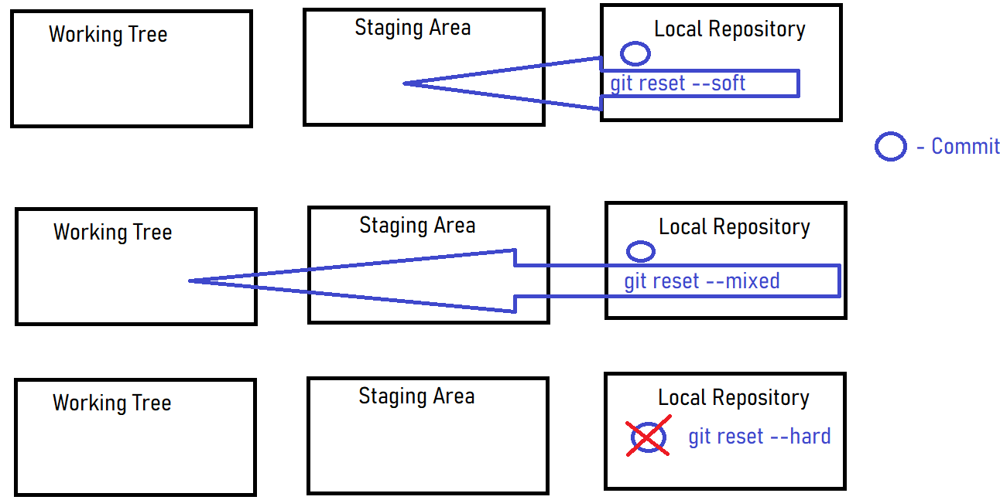
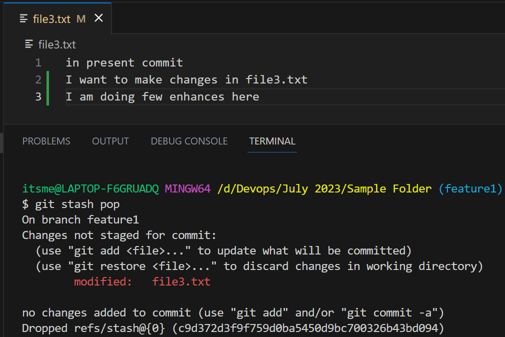

## Git Cont ...

### Git Reset
- Git Reset is using to undo your changes even after committing.
- We have 3 options here 
    - Soft
    - Hard
    - Mixed
```
itsme@LAPTOP-F6GRUADQ MINGW64 /d/Devops/July 2023/Sample Folder (master)
$ git log --oneline
c967c89 (HEAD -> master) git reset
c16e055 Reverted ffe970e this commit
ad685ab Revert "added line in file1.txt"
afc8fe0 added line in file1.txt
6dfc0db Rebase of feature1 branch


itsme@LAPTOP-F6GRUADQ MINGW64 /d/Devops/July 2023/Sample Folder (master)
$ git reset c16e055
Unstaged changes after reset:
M       file3.txt


itsme@LAPTOP-F6GRUADQ MINGW64 /d/Devops/July 2023/Sample Folder (master)
$ git status
On branch master
Changes not staged for commit:
  (use "git add <file>..." to update what will be committed)
  (use "git restore <file>..." to discard changes in working directory)
        modified:   file3.txt

no changes added to commit (use "git add" and/or "git commit -a")

itsme@LAPTOP-F6GRUADQ MINGW64 /d/Devops/July 2023/Sample Folder (master)
$ git log --oneline 
c16e055 (HEAD -> master) Reverted ffe970e this commit
ad685ab Revert "added line in file1.txt"
afc8fe0 added line in file1.txt
6dfc0db Rebase of feature1 branch
```

- Git reset --soft will move back your changes from local repsoitory to stating area
```
itsme@LAPTOP-F6GRUADQ MINGW64 /d/Devops/July 2023/Sample Folder (master)
$ git reset c16e055 --soft

itsme@LAPTOP-F6GRUADQ MINGW64 /d/Devops/July 2023/Sample Folder (master)
$ git status
On branch master
Changes to be committed:
  (use "git restore --staged <file>..." to unstage)
        modified:   file3.txt
```

- Git Reset --hard will try to remove the content which you have made on your last commit.
- It is bit dangerous command as you will be discarding all your changes
```
itsme@LAPTOP-F6GRUADQ MINGW64 /d/Devops/July 2023/Sample Folder (master)
$ git reset c16e055 --hard
HEAD is now at c16e055 Reverted ffe970e this commit
```

- Git reset --mixed will move you changes from local repository to working tree
```
itsme@LAPTOP-F6GRUADQ MINGW64 /d/Devops/July 2023/Sample Folder (master)
$ git reset c16e055 --mixed
Unstaged changes after reset:
M       file3.txt

itsme@LAPTOP-F6GRUADQ MINGW64 /d/Devops/July 2023/Sample Folder (master)
$ git status
On branch master
Changes not staged for commit:
  (use "git add <file>..." to update what will be committed)
  (use "git restore <file>..." to discard changes in working directory)
        modified:   file3.txt

no changes added to commit (use "git add" and/or "git commit -a")
```
- Pictorial representation of Git Reset


### Git Cherrypick
- If you want to merge a few commits or a single commit from one branch to another brnach that will be possible by using git cherrypick command
- checout to particular branch where you want to pick commit from another branch
- then type the following command
```
git cherry-pick <commit-id>
```

### Git Stash
```
itsme@LAPTOP-F6GRUADQ MINGW64 /d/Devops/July 2023/Sample Folder (feature1)
$ git checkout master
error: Your local changes to the following files would be overwritten by checkout:
        file3.txt
Please commit your changes or stash them before you switch branches.
Aborting
```

```
itsme@LAPTOP-F6GRUADQ MINGW64 /d/Devops/July 2023/Sample Folder (feature1)
$ git stash
Saved working directory and index state WIP on feature1: 04feaa9 Added file4 in feature4
```
