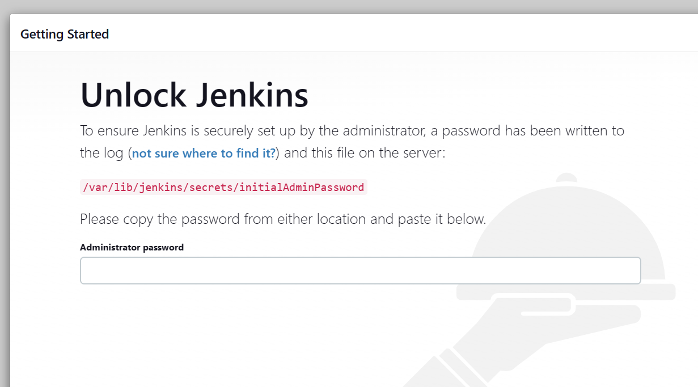
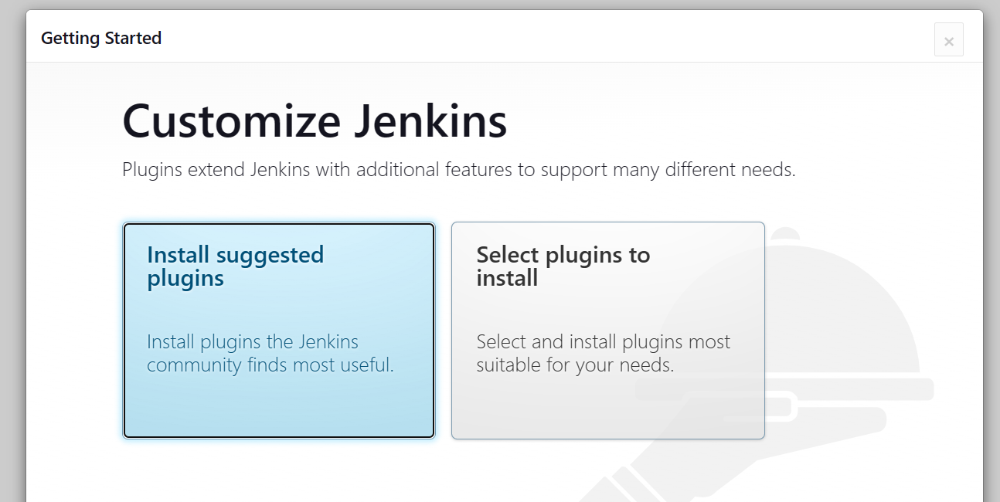
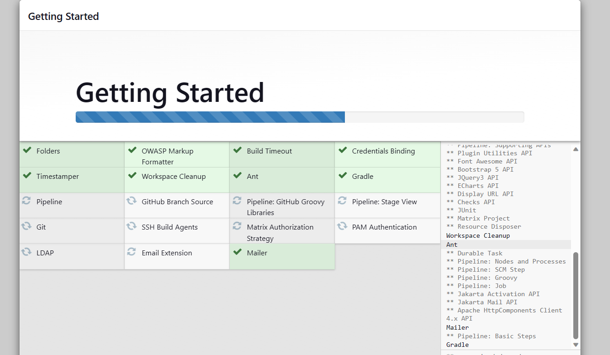
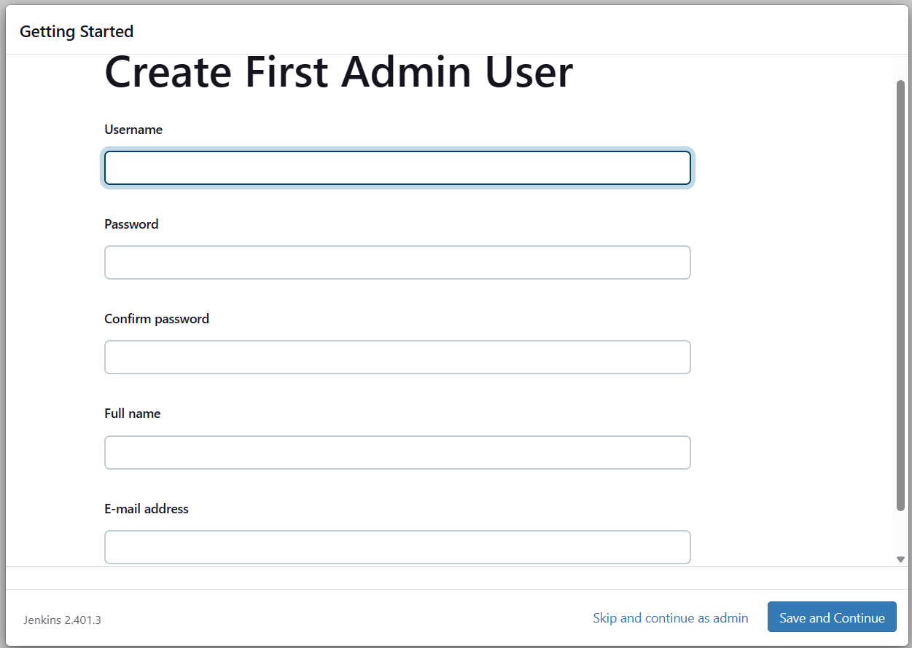
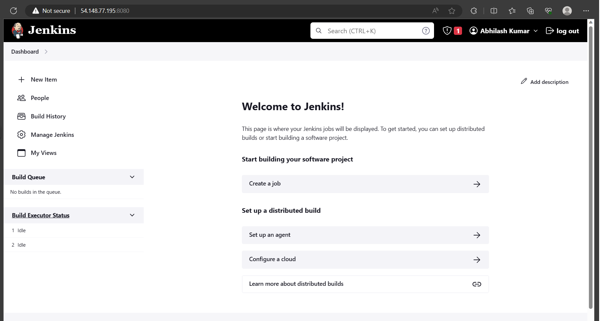

## Installing Jenkins In EC2 Instance
- Please follow the below steps to install Jenkins
- To perform any action you need to be as a root user. To move to root user after logging into your machine type the following command
```
sudo su
```
- You need to update your packages in your server. 
```
apt update
```
- Next step is to install Java in EC2 Instance
```
apt-get install openjdk-11-jdk -y
```
- To check if java is installed or not, tyep and check the below command
```
java --version
```
- To Install Jenkins, follow the below steps from official docmentation(https://www.jenkins.io/doc/book/installing/linux/#debianubuntu) from Jenkins. For your reference please follow the below commands
```
curl -fsSL https://pkg.jenkins.io/debian-stable/jenkins.io-2023.key | sudo tee \
  /usr/share/keyrings/jenkins-keyring.asc > /dev/null

echo deb [signed-by=/usr/share/keyrings/jenkins-keyring.asc] \
  https://pkg.jenkins.io/debian-stable binary/ | sudo tee \
  /etc/apt/sources.list.d/jenkins.list > /dev/null

apt-get update
apt-get install jenkins
```
- To check if jenkins is installed or not
```
jenkins --version
```
- To access your jenkins console you need to use your EC2 instance Public Ip-address followed by port no. By default port no for jenkins is 8080
```
Ex. <public-ip-address:8080>
```


- The default path for Jenkins is
```
/var/lib/jenkins/
```
- To get InitialAdminPassword cat your file and paste in your jenkins installation step and click on continue
```
cat /var/lib/jenkins/secrets/initialAdminPassword
```






