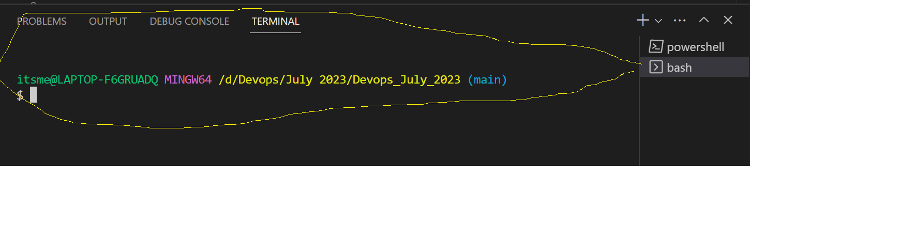
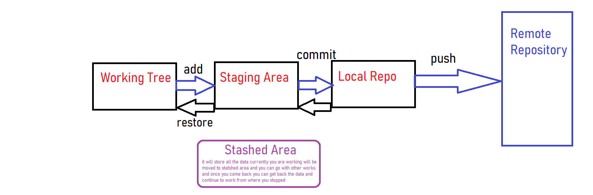

- Install Visual Studio Code from the below link
```
choco install vscode.install
```
- Open Visual Studio Code and perform the below things





## How to Initialize Git in local system.
To do Git Initialization we have to perform the below things


Type the following command in that path
```
git init
```
- When you do git init, it will try to create a .git folder inside of that empty folder.
- When you do git init, from now that folder will become as Repository instead of Folder.

## Try to create a User in git
- Below commands will create a user on your local system.
```
git config --global user.name "Username"
git config --global user.email "Email-id"
```


## Stages in Git
- We have 5 stages in Git
    - Working Tree
    - Stating Area
    - Local Repository
    - Remote Repository
    - Stash Area
