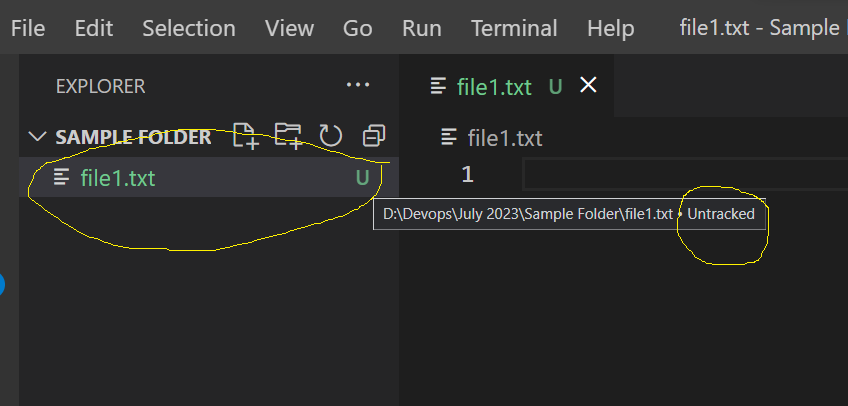
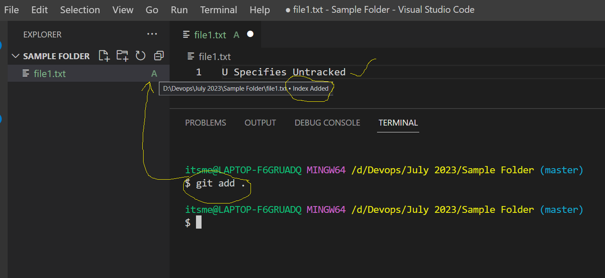
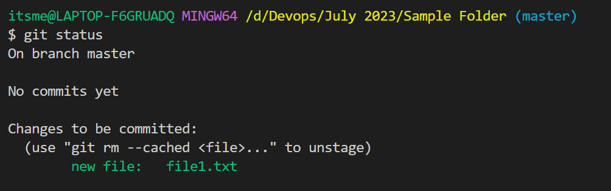
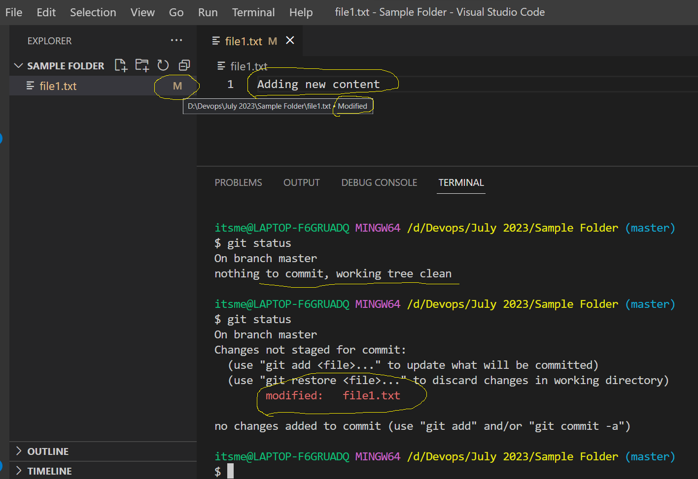
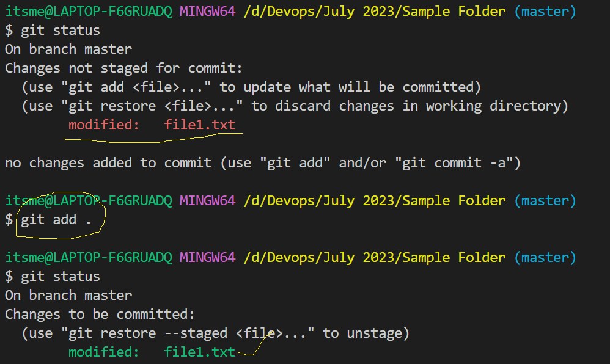
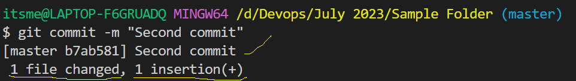
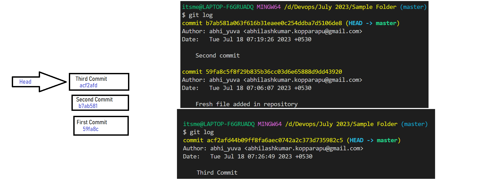

## Git cont...
- When ever you create any files for the first time it will show you as **U**.
- U represents *Untracked*. Which means there is no information related of the history with your local repository.

- Untracked files doesn't contain any status.
- The files which are there in Untracked list will be in working tree/area.
- To move the changes from Working tree to staging area we have to give the following command.
```
git add
```
- When we do *git add* it will move the data as added.


- To see the changes of every operation in our repository we use below command
```
git status
```
- git status will show you the following details
    1. on which branch we are in?
    2. it will show you the status of files 
    3. it will show you how many files are there to move from working area to stating area.


- To move the data from staging area to local repository we have to give the following command
```
git commit -m <Commit Message>
```
- Commit message will be used to track the data which was added in your local repository.
- Commit message should be relavent to your changes in your repository.
- After adding the data to your local repository it will contain the following things
    - modified
    - added
    - deleted






**Git Log**
- Git Log will give the following information
    1. Commit ID
    2. Ownere Information
    3. Time Stamp
    4. Commit Message
    5. Head Position
