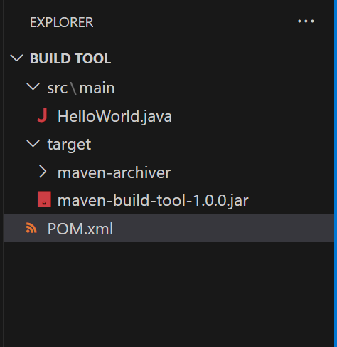

## Maven Cont...

- Install Maven in your local system with the following command and check if maven is properly installed or not
```
#Install Maven
choco install maven -y

# Check for Maven Version
mvn --version
```

- Please change your path to the place where your code exist and try to explore the lifecycle goals.
- To run your maven goals we need to create a **POM.xml** which will have the dependecies to run your project.
- Sample POM.xml file as below
```
<project xmlns="http://maven.apache.org/POM/4.0.0"   
xmlns:xsi="http://www.w3.org/2001/XMLSchema-instance"  
  xsi:schemaLocation="http://maven.apache.org/POM/4.0.0   
http://maven.apache.org/xsd/maven-4.0.0.xsd">  

<modelVersion>4.0.0</modelVersion>

<groupId>sample.maven.project</groupId>
<artifactId>maven-build-tool</artifactId>
<version>1.0.0</version>
<packaging>jar</packaging>

<properties>
    <maven.compiler.source>11</maven.compiler.source>
    <maven.compiler.target>11</maven.compiler.target>
</properties>

<dependencies>
    <dependency>

    </dependency>
    
</dependencies>

<build>
    <sourceDirectory></sourceDirectory>
    <fileName></fileName>
    <plugins>
        <plugin>

        </plugin>
    </plugins>
</build>

</project>


```

- For now to run your project the POM.xml file will looks like below
```
<project xmlns="http://maven.apache.org/POM/4.0.0"   
xmlns:xsi="http://www.w3.org/2001/XMLSchema-instance"  
  xsi:schemaLocation="http://maven.apache.org/POM/4.0.0   
http://maven.apache.org/xsd/maven-4.0.0.xsd">  

<modelVersion>4.0.0</modelVersion>

<groupId>sample.maven.project</groupId>
<artifactId>maven-build-tool</artifactId>
<version>1.0.0</version>
<packaging>jar</packaging>

<properties>
    <maven.compiler.source>11</maven.compiler.source>
    <maven.compiler.target>11</maven.compiler.target>
</properties>

</project>
```

- Now we can run our goals.
- **mvn validate**
```
PS D:\Devops\July 2023\Build tool> mvn validate
[INFO] Scanning for projects...
[INFO] 
[INFO] ---------------< sample.maven.project:maven-build-tool >----------------
[INFO] Building maven-build-tool 1.0.0
[INFO] --------------------------------[ jar ]---------------------------------
[INFO] ------------------------------------------------------------------------
[INFO] BUILD SUCCESS
[INFO] ------------------------------------------------------------------------
[INFO] Total time:  0.118 s
[INFO] Finished at: 2023-08-18T07:35:05+05:30
[INFO] ------------------------------------------------------------------------
PS D:\Devops\July 2023\Build tool>
```

- **mvn compile**
```
PS D:\Devops\July 2023\Build tool> mvn compile
[INFO] Scanning for projects...
[INFO] 
[INFO] ---------------< sample.maven.project:maven-build-tool >----------------
[INFO] Building maven-build-tool 1.0.0
[INFO] --------------------------------[ jar ]---------------------------------
[INFO] 
[INFO] --- maven-resources-plugin:2.6:resources (default-resources) @ maven-build-tool ---
[WARNING] Using platform encoding (Cp1252 actually) to copy filtered resources, i.e. build is platform dependent!
[INFO] skip non existing resourceDirectory D:\Devops\July 2023\Build tool\src\main\resources
[INFO] 
[INFO] --- maven-compiler-plugin:3.1:compile (default-compile) @ maven-build-tool ---
[INFO] No sources to compile
[INFO] ------------------------------------------------------------------------
[INFO] BUILD SUCCESS
[INFO] ------------------------------------------------------------------------
[INFO] Total time:  1.595 s
[INFO] Finished at: 2023-08-18T07:37:50+05:30
[INFO] ------------------------------------------------------------------------
```

- **mvn package**
```
PS D:\Devops\July 2023\Build tool> mvn package
[INFO] Scanning for projects...
[INFO] 
[INFO] ---------------< sample.maven.project:maven-build-tool >----------------
[INFO] Building maven-build-tool 1.0.0
[INFO] --------------------------------[ jar ]---------------------------------
[INFO] 
[INFO] --- maven-resources-plugin:2.6:resources (default-resources) @ maven-build-tool ---
[WARNING] Using platform encoding (Cp1252 actually) to copy filtered resources, i.e. build is platform dependent!
[INFO] skip non existing resourceDirectory D:\Devops\July 2023\Build tool\src\main\resources
[INFO]
[INFO] --- maven-compiler-plugin:3.1:compile (default-compile) @ maven-build-tool ---
[INFO] No sources to compile
[INFO]
[INFO] --- maven-resources-plugin:2.6:testResources (default-testResources) @ maven-build-tool ---
[WARNING] Using platform encoding (Cp1252 actually) to copy filtered resources, i.e. build is platform dependent!
[INFO] skip non existing resourceDirectory D:\Devops\July 2023\Build tool\src\test\resources
[INFO]
[INFO] --- maven-compiler-plugin:3.1:testCompile (default-testCompile) @ maven-build-tool ---
[INFO] No sources to compile
[INFO]
[INFO] --- maven-surefire-plugin:2.12.4:test (default-test) @ maven-build-tool ---
[INFO] No tests to run.
[INFO]
[INFO] --- maven-jar-plugin:2.4:jar (default-jar) @ maven-build-tool ---
[WARNING] JAR will be empty - no content was marked for inclusion!
[INFO] Building jar: D:\Devops\July 2023\Build tool\target\maven-build-tool-1.0.0.jar
[INFO] ------------------------------------------------------------------------
[INFO] BUILD SUCCESS
[INFO] ------------------------------------------------------------------------
[INFO] Total time:  1.492 s
[INFO] Finished at: 2023-08-18T07:38:43+05:30
[INFO] ------------------------------------------------------------------------
```
- Structure of Your Project will looks like this


