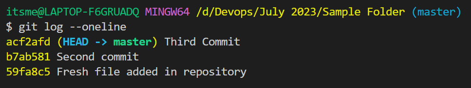
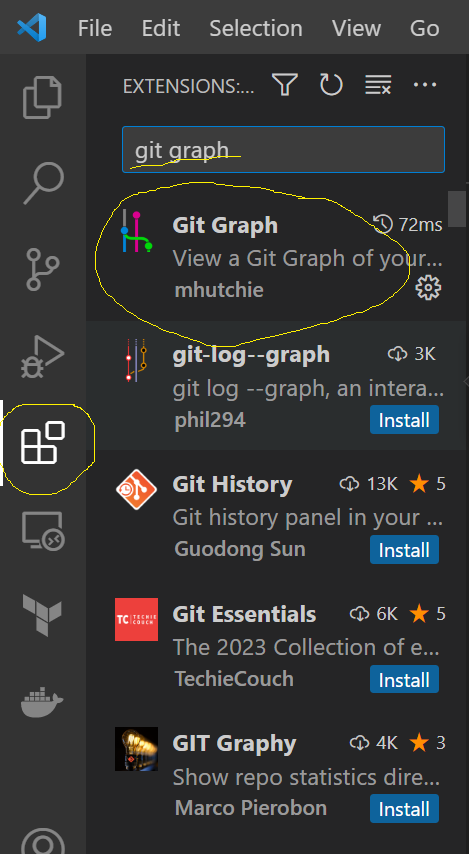
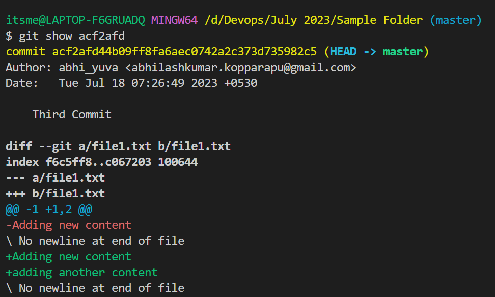
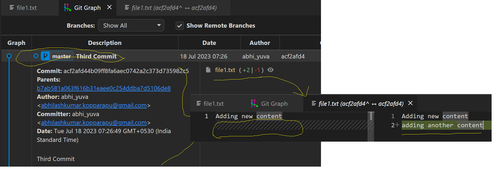
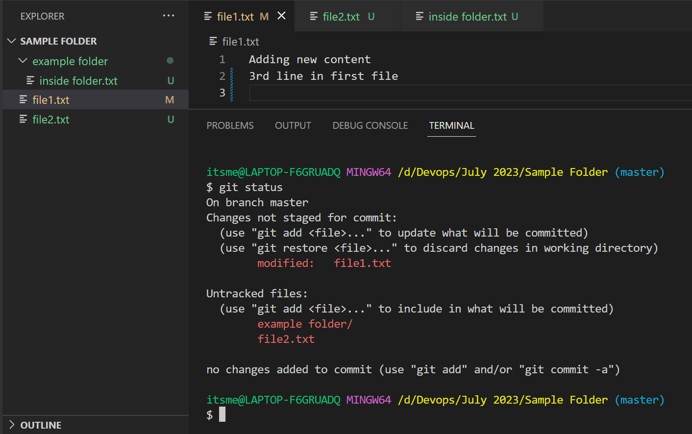
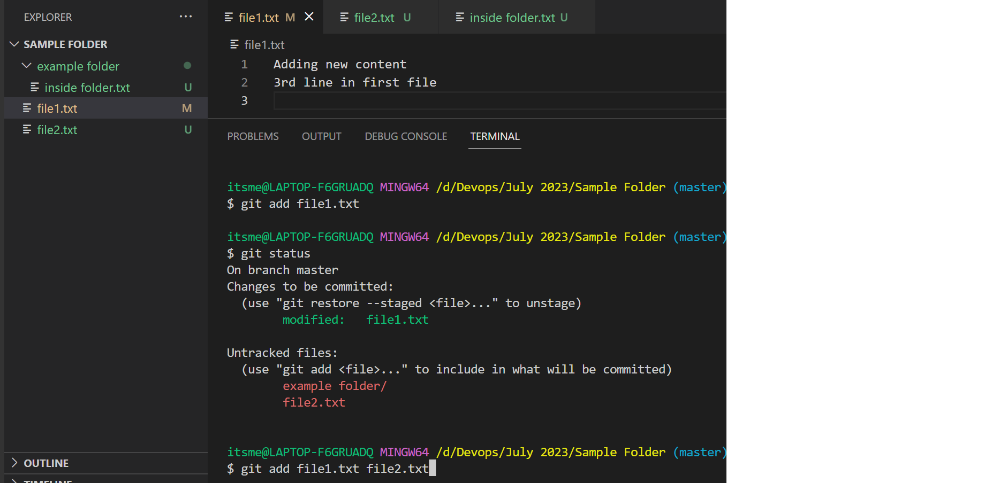
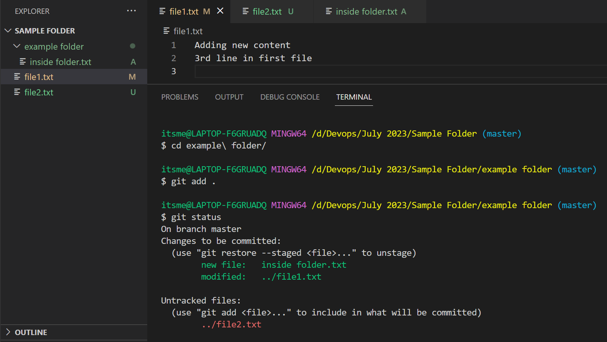

## Git cont...

**Git Log In detail**
- when you are having more no of log's it is not practically possible to go through all the commit one be one at a time.
- We have an option to see a shor description of your all commits with the following command
```
git log --oneline
```


- We have an another simplest method to view your logs. In VSC we have an toll called *Git Graph*. Install it


**git show**
- Git show command is used to see in detial description about a single commit or multiple commits.
- Useage of Command is
```
git show <commit-id>
```
- Commit id can be passed in shorter form
*result*



**git add**
- Git add will move your data from Working Tree to Staging Area
- My requirement is that I want to move only few files instaead of all the files at a time to staging area.
```
git add . --> it will move all the filies to staging area in that current path

git add <file-name>
```



