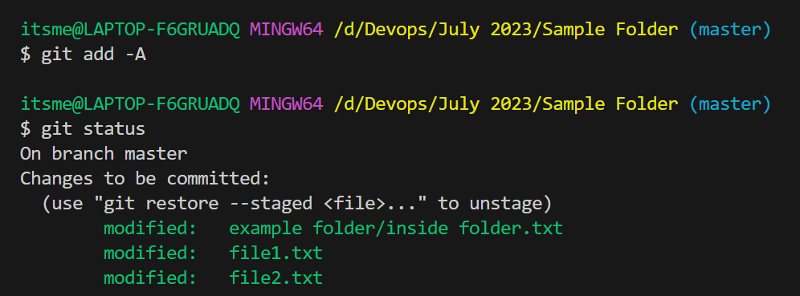
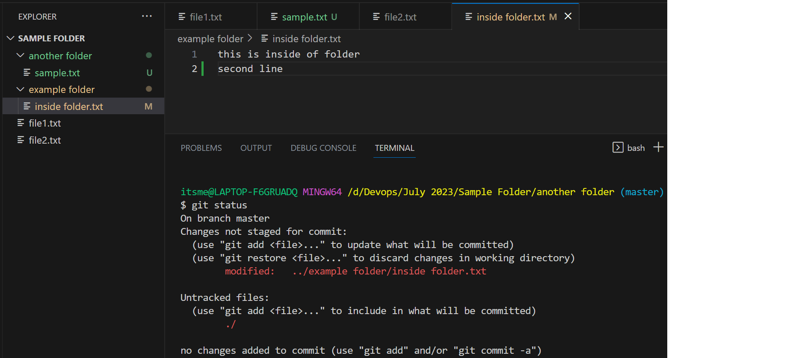
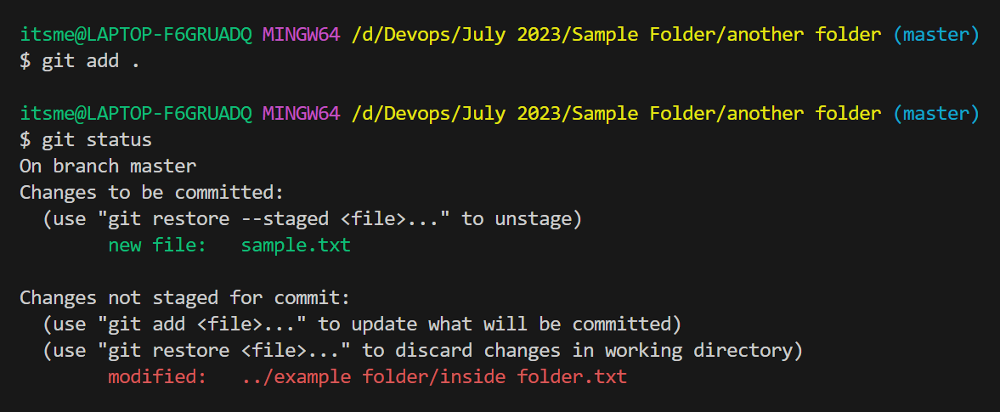
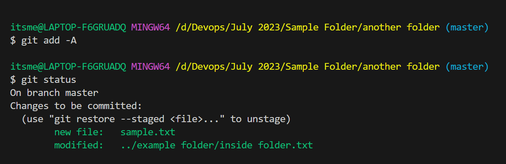
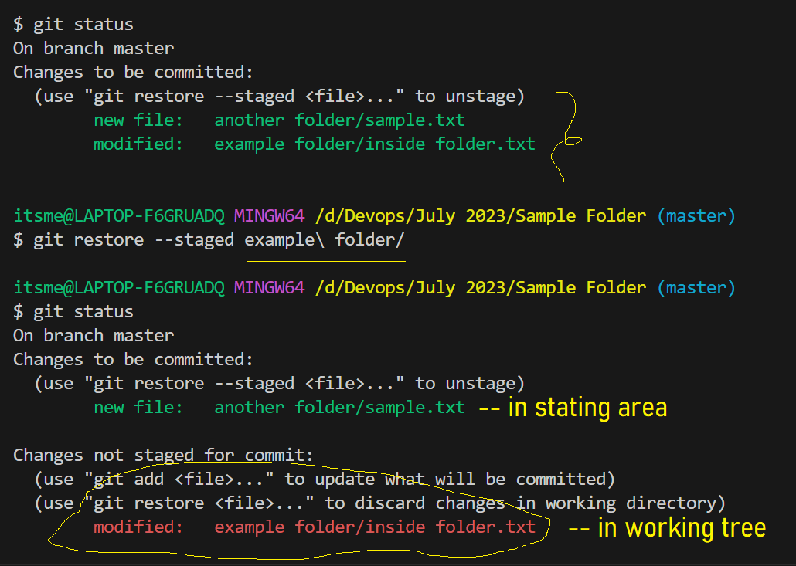
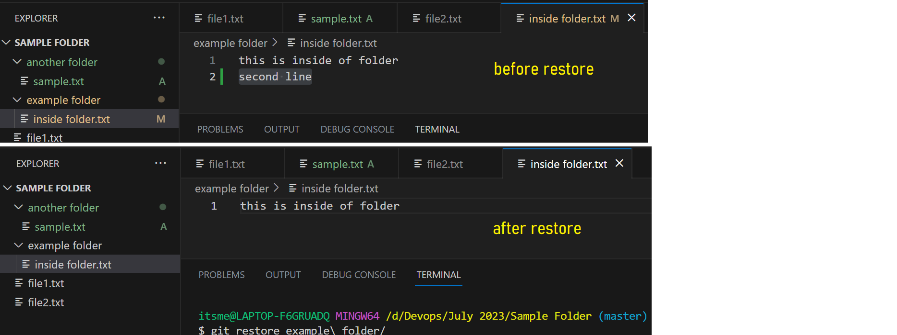

## Gid Cont...

**git add -A**
- *Git add -A* will try to move all the data from working tree to stating area irrespective of the folder where you are in.
- But *Git add .* will try to move the data from working tree to stating area only in the folder where you are in.





**Scenario**
- I have a requiremnt to undo my latest chages which was there in stating area.
- Here I can move a single file or all the files at a time
- We have a command called **git restore**
- *git restore* will try to restore the files specified to the previous version or simply we can say undo your current changes.
- The command to do that 
```
git restore --staged <file-name> <path>
```
- Current status of my files

- After restore a single file


**Scenario**
- I want to revert back all the changes from working tree
- We will use the same command *git restore*
```
git restore <file-name>/<specific-path>
```
