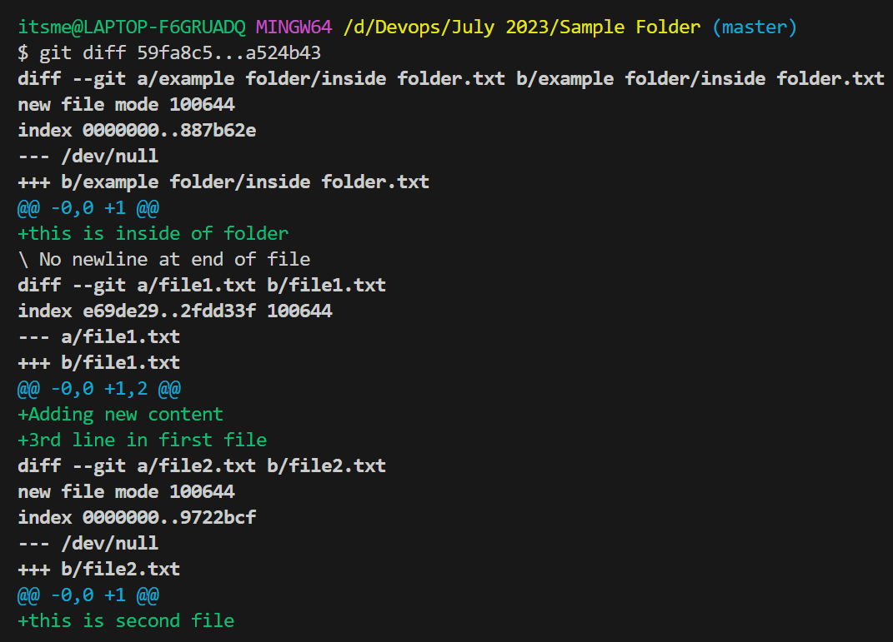

### Git cont...

**Scenario**
- I want to discard the changes from working tree which are untracked.
- To do that we have a command called
```
git clean
```
- *Git Clean* will try to remove untracked files from working tree
- In Git clean we have a major 3 options
    - *-i* this is an interactive mode which will give you options to select files before discarding
    
    - *-n/--dry-run* this will give you an actuall content which is going to be discarded before taking action
    
    - *-f/--force* this is a force to discard the changes
    - *-d* this is to remove directories

### Git Diff/Difference
- This commmand will try to show you the difference between one or more commits.
```
git diff <commit-id>
```
- Only *git diff* if you specify it will try to show you the current changes in files which were still in working tree


- If you specify *git diff <commit-id1> <commit-id2> it will show you the differnce between those 2 commit's
```
$ git log --oneline
30ef4ff (HEAD -> master) modifed a single line in file1
a524b43 added fresh files and folder
acf2afd Third Commit
b7ab581 Second commit
59fa8c5 Fresh file added in repository
```
- I want to see the difference between second commit and third commit
```
git diff b7ab581 acf2afd
```


- if you want to see the differences between multiple commits. The command will be like this
```
git diff <starting-commit-id>...<endig-commit-id>
```

