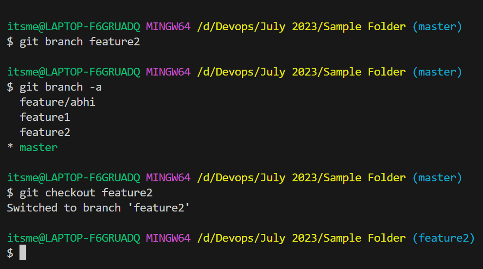
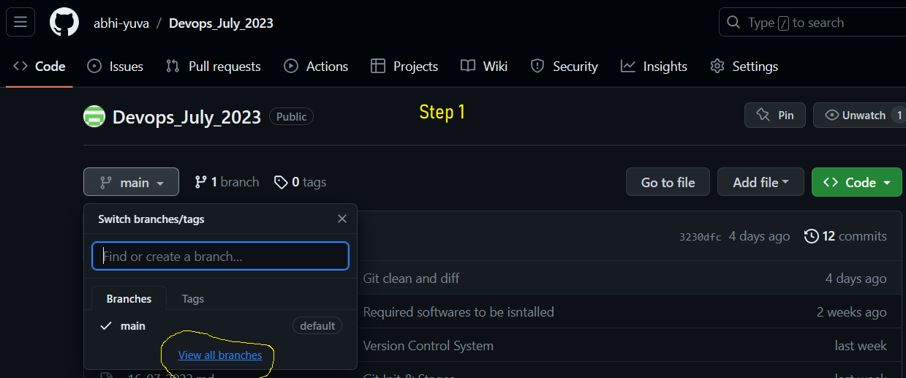
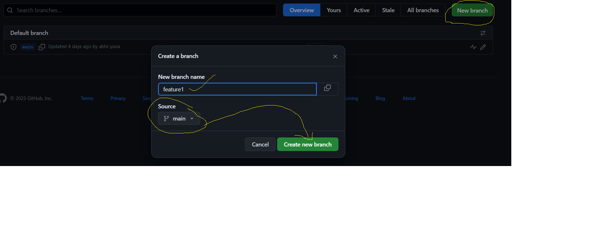
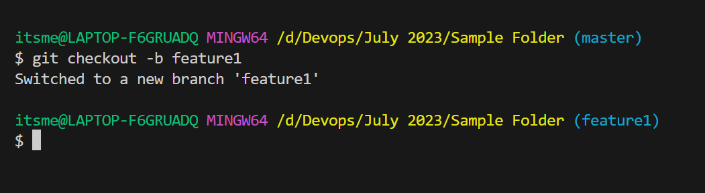
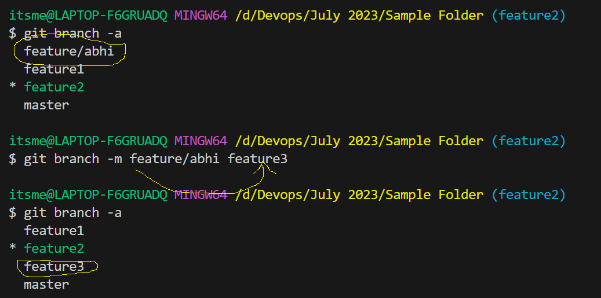
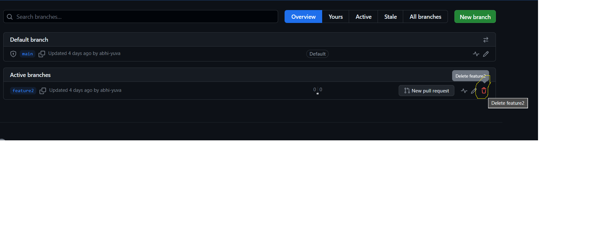
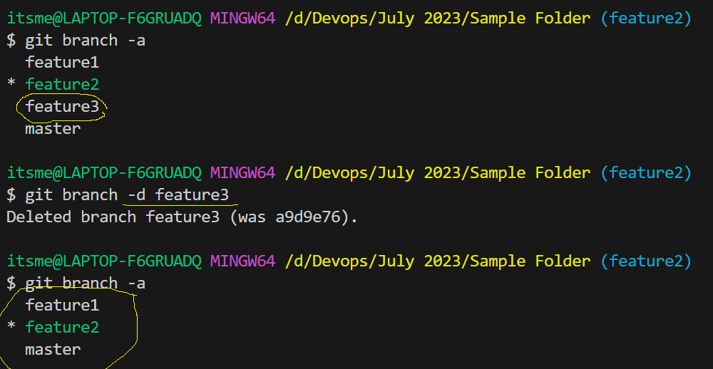
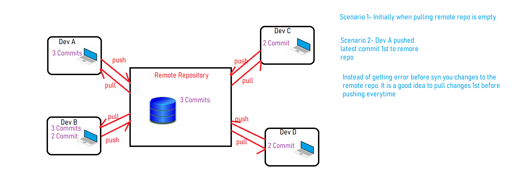

## Git Branch cont...

- Git branch can be created in 3 ways
    1. Directly creating a branch in Local System and then we can push it to remote repository
    ```
    git branch <branch-name>
    ```
    
    2. From GitHub Console and we can pull the latest changes from remote repository to local repository
    
    
    3. While doing checkout also we can create a branch in local system
    ```
    git checkout -b <branch-name>
    ```
    

### How to rename a branch

- We have 2 ways to rename a branch
    1. From Github Console
    

    2. From Local System
    ```
    git branch -m <old-branch-name> <new-branch-name>
    ```
    

- We have another option to rename both local and remote branches at a time
```
git push origin <old-branch-name> <new-branch-name>
```

### How to delete a branch

- We have 2 ways to delete a branch
    1. From Github Console
    
    2. From Local System
    ```
    git branch -d <branch-name>
    ```
    


## Git Pull
- This command to try to fetch the data from remote repository and will try to update you local system to synchronize with remote repo.
```
git pull
```

