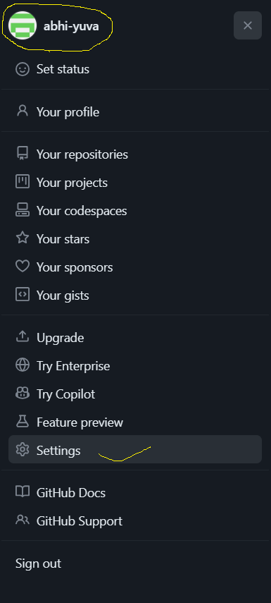
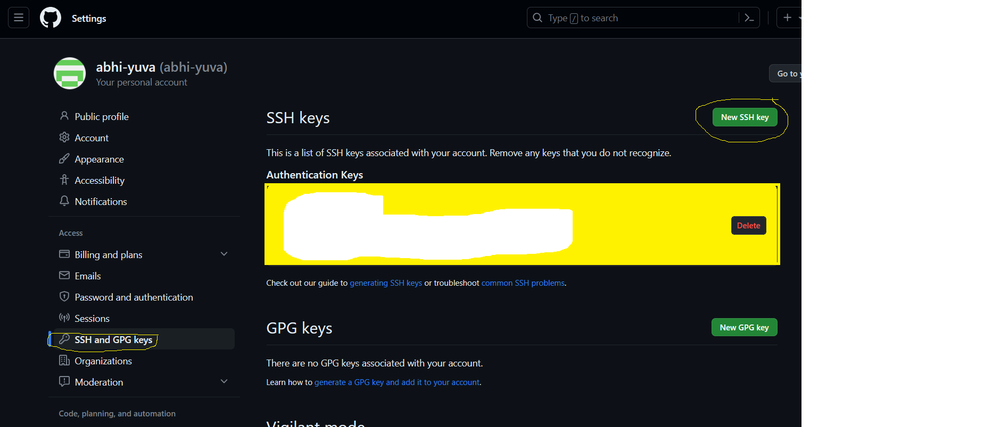
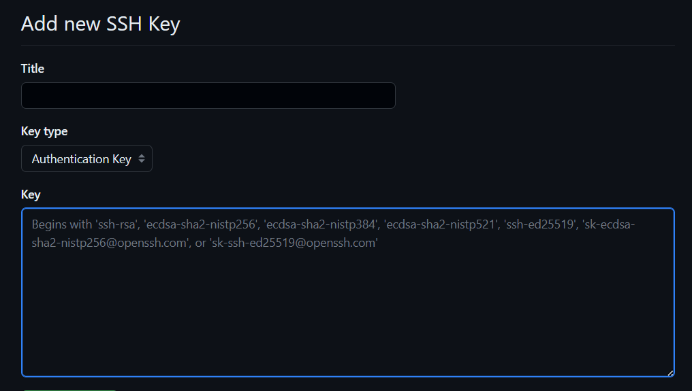
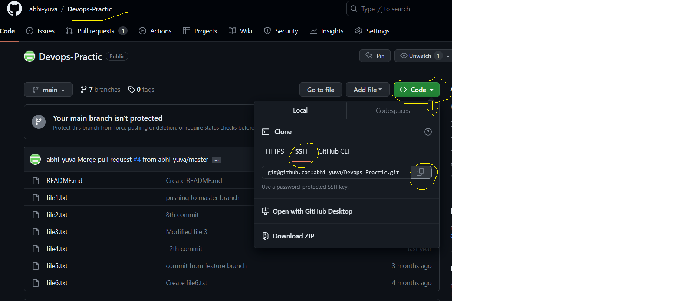
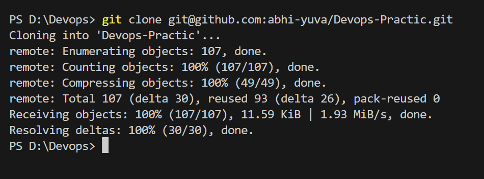
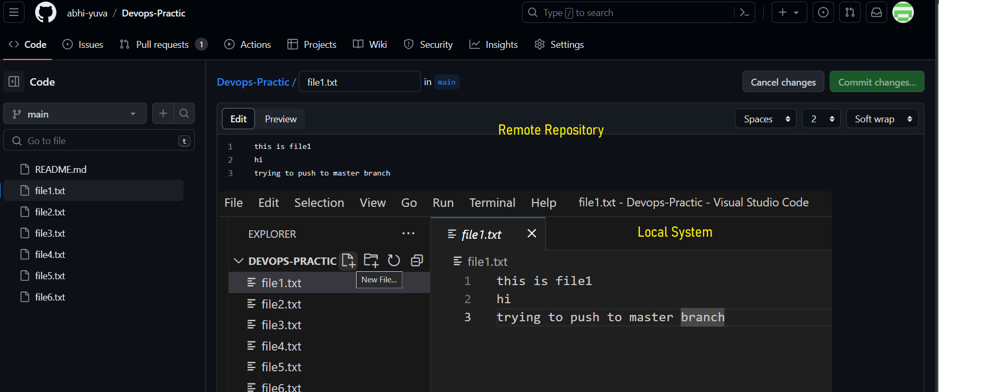
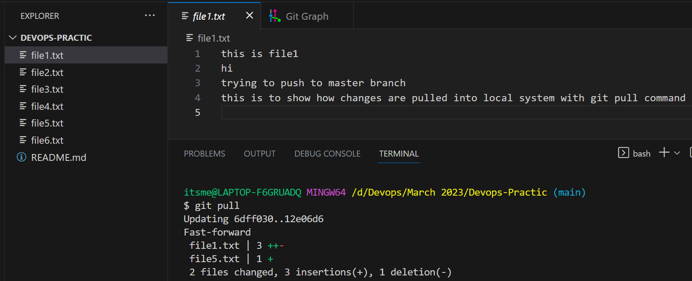

### Git Conti...

### Git Configuration
- Before cloning any repository into your local system we need to setup frist in your local system to get ready for repository.
- There are 2 ways to clone a repository in to your local system
    - By using HTTPS Connection
    - Bu using SSH Key Connection
- To setup SSH key in your local system, follow the below instructions
    - Goto your local system
    - Type the following command
    ```
    ssh-keygen
    ```
    - Then press enter for 2 times
    - SSH key will be genereated in your root folder
    - Goto Root folder and check if **.ssh** folder is created or not. If it there then ssh keys were generated successfully.
- How to copy ssh keys into github
    - First visit your profiel and goto settings
    - Under setting visit SSH & GPG Keys
    - Click on New SSH Key
    - Give the title and paste the Public key(id_rsa.pub)
    - Press enter/save
    
    
    

### How to clone a repository into your local system
- Once your setup ssh keys follow the below step to clone repo into your local system
   - Visit any repository and under code select SSH
   - Copy the code and in your local system type the below command
   ```
   git clone <git-url>
   ```
   
   

### How Pull works
- When you do git pull it will try to syn the latest changes into your local system with the remote repository.
- Git pull is similar to the below command
```
git fetch and merge
``` 



### Difference between Git Fetch and Git Pull
- **Git Fetch** will try to show the changes with remote repository to your local system but it wont merge the changes in your local system.
- **Git Pull** will try to fetch the changes and merge the changes into yoru local system.
```
itsme@LAPTOP-F6GRUADQ MINGW64 /d/Devops/March 2023/Devops-Practic (main)
$ git fetch
remote: Enumerating objects: 5, done.
remote: Counting objects: 100% (5/5), done.
remote: Compressing objects: 100% (3/3), done.
remote: Total 3 (delta 1), reused 0 (delta 0), pack-reused 0
Unpacking objects: 100% (3/3), 700 bytes | 38.00 KiB/s, done.
From https://github.com/abhi-yuva/Devops-Practic
   12e06d6..d2636fe  main       -> origin/main


itsme@LAPTOP-F6GRUADQ MINGW64 /d/Devops/March 2023/Devops-Practic (main)
$ git show d2636fe
commit d2636fe70b952eca8d9b5ff4504e019f7d26832c (origin/main, origin/HEAD)
Author: abhi-yuva <95558376+abhi-yuva@users.noreply.github.com>
Date:   Wed Jul 26 07:25:49 2023 +0530

    git fetch

diff --git a/file2.txt b/file2.txt
index 4994432..f1289a4 100644
--- a/file2.txt
+++ b/file2.txt
@@ -1,3 +1,4 @@
 this is file2
 im learning devops
-task
\ No newline at end of file
+task
+to show the difference between git fetch and git pull

itsme@LAPTOP-F6GRUADQ MINGW64 /d/Devops/March 2023/Devops-Practic (main)
$
```