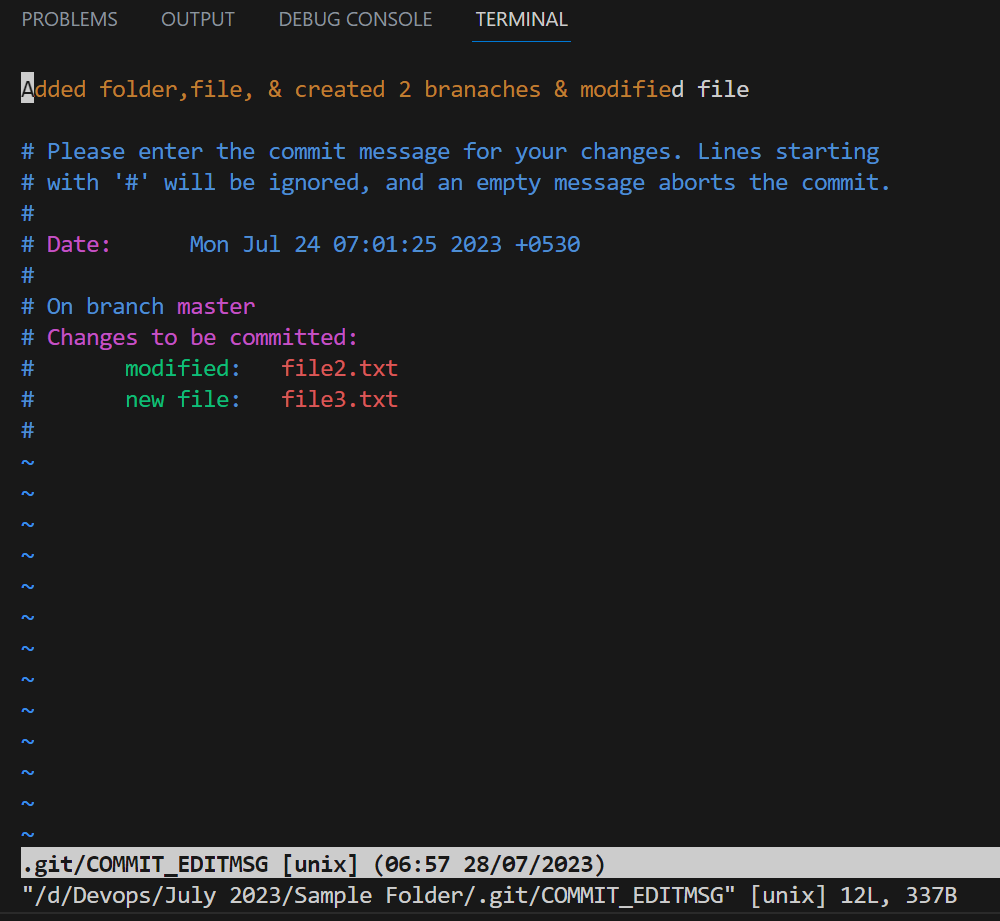
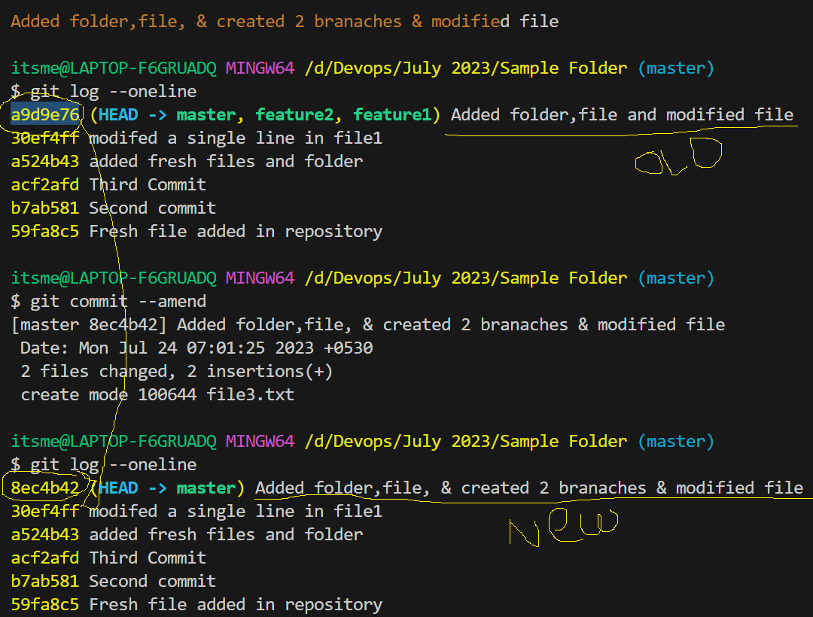
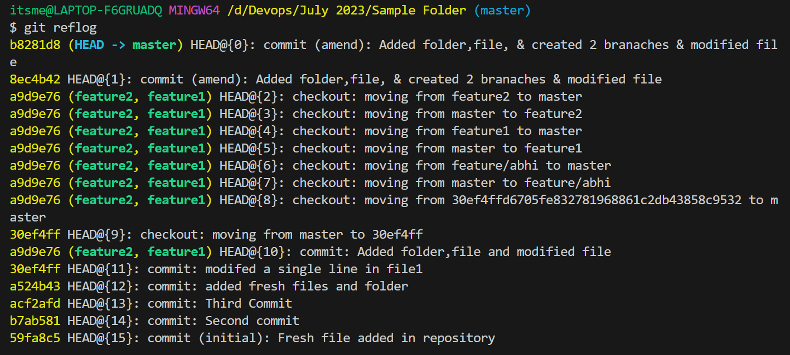

### Scenario
1. After commiting, I want to modfiy my commit message.
    - If you want to modify the commit message, we have a command called
    ```
    git commit --amend
    ```
    - When we type the above command, it will take us to the editor mode where we can try to modify the commit message.
    - Press **i** it will be in insert mode
    - Modify the commit message the prese
        - esc then
        - :wq and press enter
    - After that it will save the commit message but commit id will be changed
    
    

    - When ever we type **git commit --amend** it will try to modify the current commit or latest message

- Here when we are modifying the commit message every time commit id will changes. If you wan to see all the operations which we performed, we have one command called
```
git reflog
```


### Git Branches Cont...


