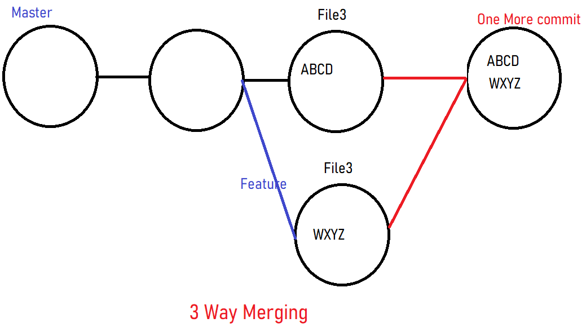
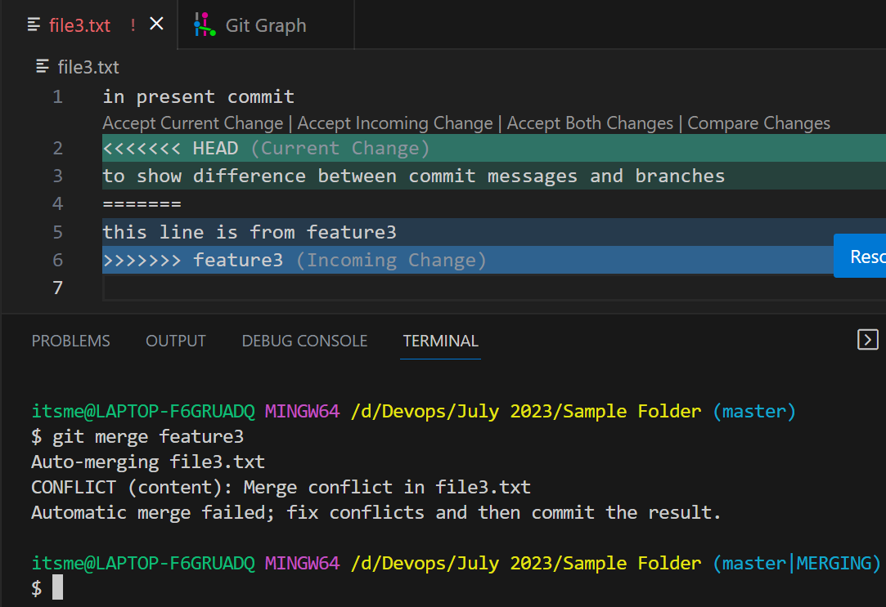
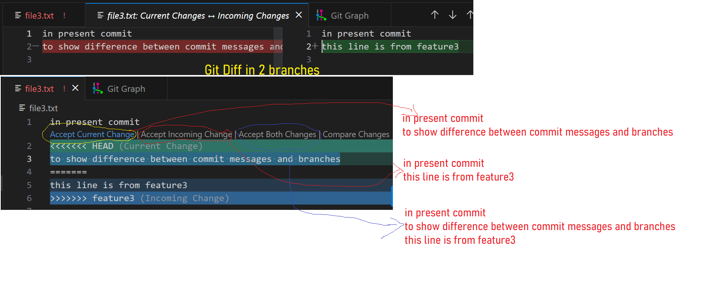
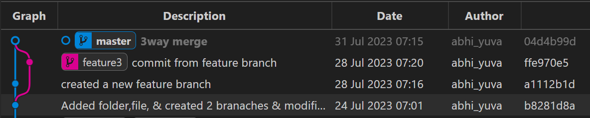
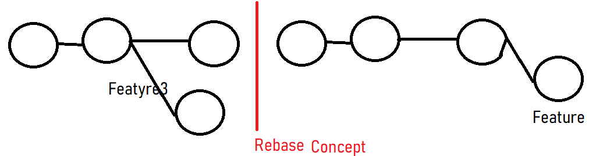

## Git cont...
### Merging in Git
- **What is the need of merging?**
    - When ever developers are working on their local repository and when they are done, they are supposed to merge back their changes to either the base branch or any stable branch.
    - This method is the recommended way
    - Reason is that as they are working on their local repository to enchane or to rectify any bugs, or to devope a new feature.
    - We are supposed to take those changes and reflect them in our application.
    - If we want to reflect the changes in application, we need to combine everyone's code into one place so that we can take up that further to take any action.

### Merging in Git has multiple ways.
- Basically we have 3 ways of merging the changes.
    - **3 Way Merge**
    - **Fast Forward Merge**
    - **Rebase**

### 3 Way Merge
- When ever you want to merge you changes to a particular branch, you have be in that branch 1st and the do merging by using the below command
```
git merge <branch-name>
```
- This 3 way merging concept comes when ever you get a merge conflicts.
- Merge Conflicts comes when your content is mismatching with the other content.
- We are supposed to modify or resolve that confict and then merge you changes
- After resolving your content when you try to merge, git will try to create a commit top of the both commits.
- This we call it as a **3 Way Merge**


```
itsme@LAPTOP-F6GRUADQ MINGW64 /d/Devops/July 2023/Sample Folder (master)
$ git merge feature3
Auto-merging file3.txt
CONFLICT (content): Merge conflict in file3.txt
Automatic merge failed; fix conflicts and then commit the result.

itsme@LAPTOP-F6GRUADQ MINGW64 /d/Devops/July 2023/Sample Folder (master|MERGING)
$ git add .

itsme@LAPTOP-F6GRUADQ MINGW64 /d/Devops/July 2023/Sample Folder (master|MERGING)
$ git commit -m "3way merge"
[master 04d4b99] 3way merge

itsme@LAPTOP-F6GRUADQ MINGW64 /d/Devops/July 2023/Sample Folder (master)
$
```






### Fast Forward Merge
- When you dont have any conflicts it will result in fast forward merge
```
itsme@LAPTOP-F6GRUADQ MINGW64 /d/Devops/July 2023/Sample Folder (feature3)

File2.txt
this is second file
this is the latest line
this is from feature3 and it is fast forward merge

itsme@LAPTOP-F6GRUADQ MINGW64 /d/Devops/July 2023/Sample Folder (master)
File2.txt
this is second file
this is the latest line
```
- Go to master branch and type the belwo command
```
git merge feature3

itsme@LAPTOP-F6GRUADQ MINGW64 /d/Devops/July 2023/Sample Folder (master)
$ git merge feature3
Merge made by the 'ort' strategy.
 file2.txt | 3 ++-
 1 file changed, 2 insertions(+), 1 deletion(-)
```
- Present content in my master branch
```
File2.txt

this is second file
this is the latest line
this is from feature3 and it is fast forward merge
```

### Rebase
