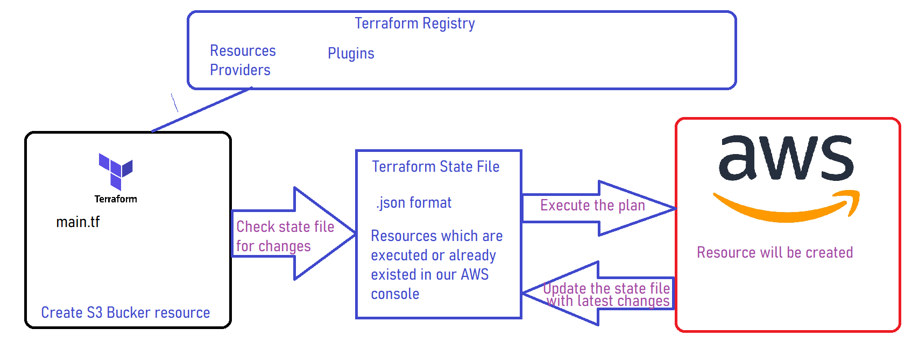
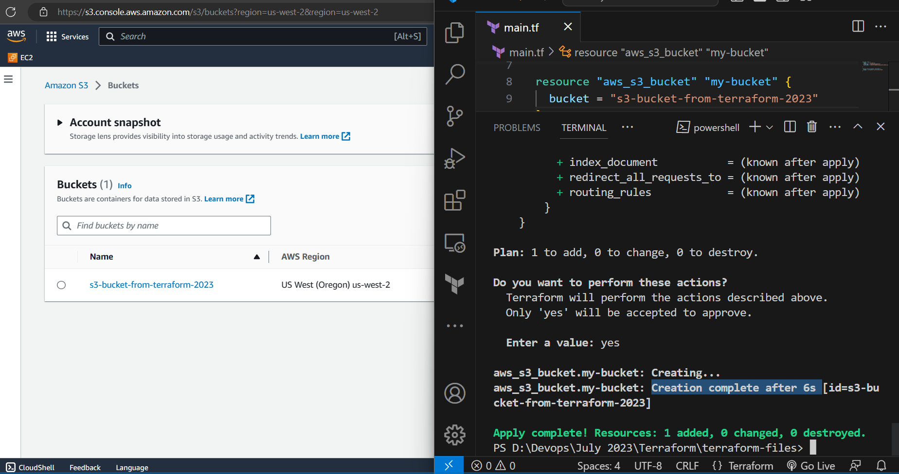
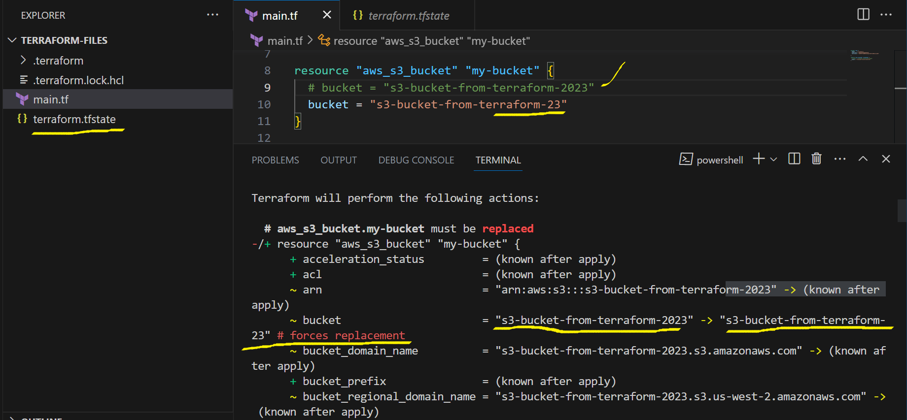
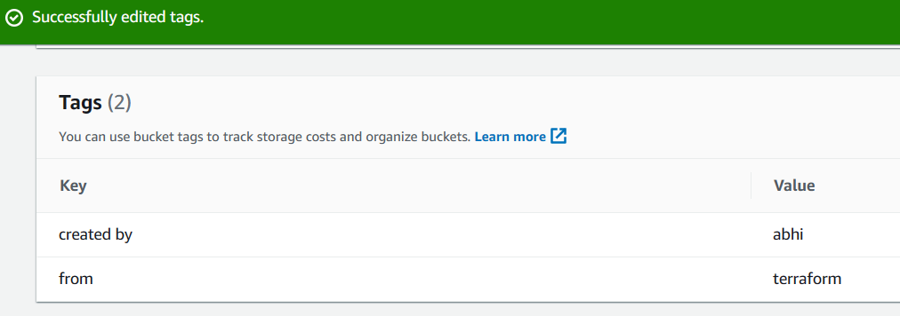
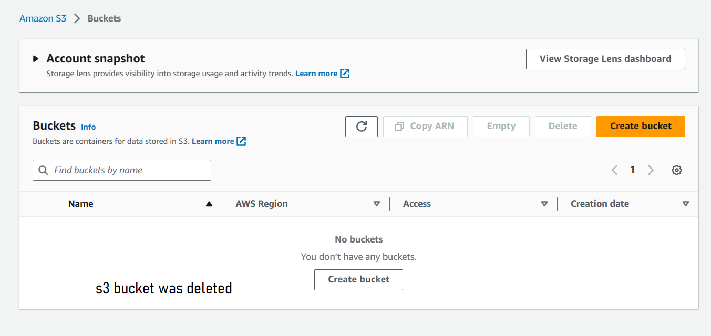

## Terraform Cont...
- After initalization we have to do **terraform validate** which will check our terraform file is perfrectly alright or not and if it is not perfect it will try to show you the errors.
- After validate you have to check for the format of our terraform files that are we writing our file in correct sytactical way or did any mistakes.
- When you do run **terrafrom fmt** command it will try to adjust your terrform file which matches in correct syntactical format.
- Here is the example for terraform fmt
```
provider "aws" {
region = "us-west-2"
}

resource "aws_s3_bucket" "my-bucket" {
bucket = "s3-bucket-from-terraform-2023"
}


```
- After Terraform fmt
```
PS D:\Devops\July 2023\Terraform\terraform-files> terraform fmt
main.tf

provider "aws" {
  region     = "us-west-2"

}

resource "aws_s3_bucket" "my-bucket" {
  bucket = "s3-bucket-from-terraform-2023"
}
```
- Before applying execution plan please perform **terrafrom plan**
- Terraform Plan will show you an blueprint that what actions your are going to perform
```
PS D:\Devops\July 2023\Terraform\terraform-files> terraform plan

Terraform used the selected providers to generate the following execution plan. Resource actions are indicated with the following
symbols:
  + create

Terraform will perform the following actions:

  # aws_s3_bucket.my-bucket will be created
  + resource "aws_s3_bucket" "my-bucket" {
      + acceleration_status         = (known after apply)
      + acl                         = (known after apply)
      + arn                         = (known after apply)
      + bucket                      = "s3-bucket-from-terraform-2023"
      + bucket_domain_name          = (known after apply)
      + bucket_prefix               = (known after apply)
      + bucket_regional_domain_name = (known after apply)
      + force_destroy               = false
      + hosted_zone_id              = (known after apply)
      + id                          = (known after apply)
      + object_lock_enabled         = (known after apply)
      + policy                      = (known after apply)
      + region                      = (known after apply)
      + request_payer               = (known after apply)
      + tags_all                    = (known after apply)
      + website_domain              = (known after apply)
      + website_endpoint            = (known after apply)

      + cors_rule {
          + allowed_headers = (known after apply)
          + allowed_methods = (known after apply)
          + allowed_origins = (known after apply)
          + expose_headers  = (known after apply)
          + max_age_seconds = (known after apply)
        }

      + grant {
          + id          = (known after apply)
          + permissions = (known after apply)
          + type        = (known after apply)
          + uri         = (known after apply)
        }

      + lifecycle_rule {
          + abort_incomplete_multipart_upload_days = (known after apply)
          + enabled                                = (known after apply)
          + id                                     = (known after apply)
          + prefix                                 = (known after apply)
          + tags                                   = (known after apply)

          + expiration {
              + date                         = (known after apply)
              + days                         = (known after apply)
              + expired_object_delete_marker = (known after apply)
            }

          + noncurrent_version_expiration {
              + days = (known after apply)
            }

          + noncurrent_version_transition {
              + days          = (known after apply)
              + storage_class = (known after apply)
            }

          + transition {
              + date          = (known after apply)
              + days          = (known after apply)
              + storage_class = (known after apply)
            }
        }

      + logging {
          + target_bucket = (known after apply)
          + target_prefix = (known after apply)
        }

      + object_lock_configuration {
          + object_lock_enabled = (known after apply)

          + rule {
              + default_retention {
                  + days  = (known after apply)
                  + mode  = (known after apply)
                  + years = (known after apply)
                }
            }
        }

      + replication_configuration {
          + role = (known after apply)

          + rules {
              + delete_marker_replication_status = (known after apply)
              + id                               = (known after apply)
              + prefix                           = (known after apply)
              + priority                         = (known after apply)
              + status                           = (known after apply)

              + destination {
                  + account_id         = (known after apply)
                  + bucket             = (known after apply)
                  + replica_kms_key_id = (known after apply)
                  + storage_class      = (known after apply)

                  + access_control_translation {
                      + owner = (known after apply)
                    }

                  + metrics {
                      + minutes = (known after apply)
                      + status  = (known after apply)
                    }

                  + replication_time {
                      + minutes = (known after apply)
                      + status  = (known after apply)
                    }
                }

              + filter {
                  + prefix = (known after apply)
                  + tags   = (known after apply)
                }

              + source_selection_criteria {
                  + sse_kms_encrypted_objects {
                      + enabled = (known after apply)
                    }
                }
            }
        }

      + server_side_encryption_configuration {
          + rule {
              + bucket_key_enabled = (known after apply)

              + apply_server_side_encryption_by_default {
                  + kms_master_key_id = (known after apply)
                  + sse_algorithm     = (known after apply)
                }
            }
        }

      + versioning {
          + enabled    = (known after apply)
          + mfa_delete = (known after apply)
        }

      + website {
          + error_document           = (known after apply)
          + index_document           = (known after apply)
          + redirect_all_requests_to = (known after apply)
          + routing_rules            = (known after apply)
        }
    }

Plan: 1 to add, 0 to change, 0 to destroy.

```
- Here is the process of terraform worflow

- After terraform plan we have execute our resources with **terraform apply** command.
- When you run apply command it will try to show you the plan again and will ask for your confirmation to execute it or not.
```
Plan: 1 to add, 0 to change, 0 to destroy.

Do you want to perform these actions?
  Terraform will perform the actions described above.
  Only 'yes' will be accepted to approve.

  Enter a value: yes

aws_s3_bucket.my-bucket: Creating...
aws_s3_bucket.my-bucket: Creation complete after 6s [id=s3-bucket-from-terraform-2023]

Apply complete! Resources: 1 added, 0 changed, 0 destroyed.
```
- Only after apply it will execute your plan


- Now we will see how terraform state file works
- Terraform plan if you do changes from terraform file


- Terraform plan with AWS console changes. Our modification as like below

- Below is the terraform plan output(Before modification)
```
PS D:\Devops\July 2023\Terraform\terraform-files> terraform plan
aws_s3_bucket.my-bucket: Refreshing state... [id=s3-bucket-from-terraform-2023]

No changes. Your infrastructure matches the configuration.

Terraform has compared your real infrastructure against your configuration and found no
differences, so no changes are needed.
```
- AFter Modification
```
PS D:\Devops\July 2023\Terraform\terraform-files> terraform plan
aws_s3_bucket.my-bucket: Refreshing state... [id=s3-bucket-from-terraform-2023]

Terraform used the selected providers to generate the following execution plan. Resource actions
are indicated with the following symbols:
  ~ update in-place

Terraform will perform the following actions:

  # aws_s3_bucket.my-bucket will be updated in-place
  ~ resource "aws_s3_bucket" "my-bucket" {
        id                          = "s3-bucket-from-terraform-2023"
      ~ tags                        = {
          - "created by" = "abhi" -> null
          - "from"       = "terraform" -> null
        }
      ~ tags_all                    = {
          - "created by" = "abhi"
          - "from"       = "terraform"
        } -> (known after apply)
        # (9 unchanged attributes hidden)

        # (3 unchanged blocks hidden)
    }

Plan: 0 to add, 1 to change, 0 to destroy.
```

- if you want to destroy your resources run **terraform destroy** command.
```
PS D:\Devops\July 2023\Terraform\terraform-files> terraform destroy
aws_s3_bucket.my-bucket: Refreshing state... [id=s3-bucket-from-terraform-2023]

Terraform used the selected providers to generate the following execution plan. Resource actions
are indicated with the following symbols:
  - destroy

Terraform will perform the following actions:

  # aws_s3_bucket.my-bucket will be destroyed
  - resource "aws_s3_bucket" "my-bucket" {
      - arn                         = "arn:aws:s3:::s3-bucket-from-terraform-2023" -> null
      - bucket                      = "s3-bucket-from-terraform-2023" -> null
      - bucket_domain_name          = "s3-bucket-from-terraform-2023.s3.amazonaws.com" -> null
      - bucket_regional_domain_name = "s3-bucket-from-terraform-2023.s3.us-west-2.amazonaws.com" -> null
      - force_destroy               = false -> null
      - hosted_zone_id              = "Z3BJ6K6RIION7M" -> null
      - id                          = "s3-bucket-from-terraform-2023" -> null
      - object_lock_enabled         = false -> null
      - region                      = "us-west-2" -> null
      - request_payer               = "BucketOwner" -> null
      - tags                        = {
          - "created by" = "abhi"
          - "from"       = "terraform"
        } -> null
      - tags_all                    = {
          - "created by" = "abhi"
          - "from"       = "terraform"
        } -> null

      - grant {
          - id          = "b1522b43d15025fda8085a89f51adcab670089bb6204d226da86bfafb2d456fb" -> null
          - permissions = [
              - "FULL_CONTROL",
            ] -> null
          - type        = "CanonicalUser" -> null
        }

      - server_side_encryption_configuration {
          - rule {
              - bucket_key_enabled = false -> null

              - apply_server_side_encryption_by_default {
                  - sse_algorithm = "AES256" -> null
                }
            }
        }

      - versioning {
          - enabled    = false -> null
          - mfa_delete = false -> null
        }
    }

Plan: 0 to add, 0 to change, 1 to destroy.

Do you really want to destroy all resources?
  Terraform will destroy all your managed infrastructure, as shown above.
  There is no undo. Only 'yes' will be accepted to confirm.

  Enter a value: yes

aws_s3_bucket.my-bucket: Destroying... [id=s3-bucket-from-terraform-2023]
aws_s3_bucket.my-bucket: Destruction complete after 1s

Destroy complete! Resources: 1 destroyed.
```

