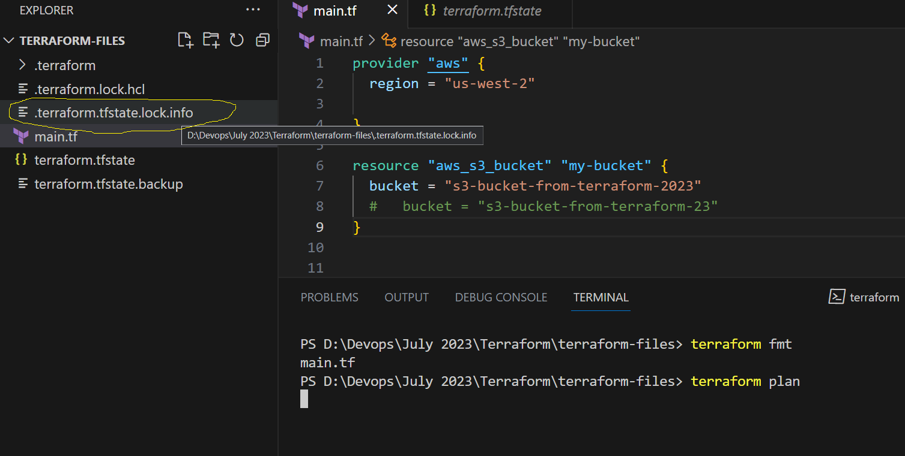
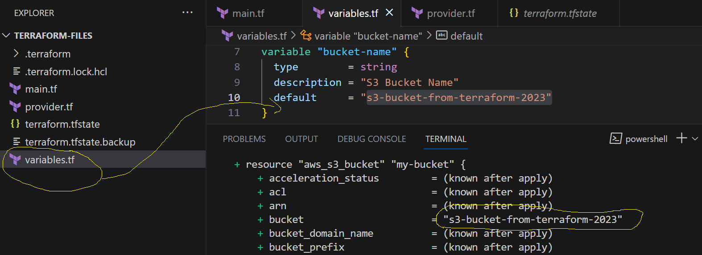

## Terraform Cont...

- In our previous calss we have seen how to create resources.
- But, from our main.tf we are trying to pass the values for *access-key & secret-key* as a hardcoded values which is not recommended.
- So, to secure our terraform file we have to pass both the values as an **environmental variable**
- We have export these values before using terraform file. For that, we have to install **CLI** of the provider which ever you are using.
- Then try to configure the values.

### How to install AWS CLI & Configure in your local system
- From Chacolatey Method
```
choco install awscli
```
- You can follow official documentaion of [AWS](https://docs.aws.amazon.com/cli/latest/userguide/getting-started-install.html) to install

- After installation to check if it is properly isntalled or not follow the below command to get output
```
$ aws --version
aws-cli/2.13.15 Python/3.11.4 Windows/10 exe/AMD64 prompt/off
```

- To configure AWS in your local sytem follow the below steps
- Type **aws configure** the pass the values as per the input. For Default Region & Default output if you dont pass any values it will take the default values from AWS.
- Below is the sample configuration format
```
C:/> aws configure
AWS Access Key ID [****************2BEZ]: <your-value>
AWS Secret Access Key [****************b0y6]: <your-value>
Default region name [us-west-2]:
Default output format [None]:
```
- When ever you do Terrafom Plan or Apply, terraform will try to create **terraform state lock** file which will lock our AWS to miscongiure or stop duplications or resources


### Variables in Terraform
- when ever you are creating any terraform file, it is recommended to create all the argument & attributes in seperate files.
- All the block related to providers, resources & other blocks have to be organized individually.
- To pass the inputs to create or deploy any resources from terraform file, we have to create variable & pass values from variables file.
- Syntax of variable as follows
```
variable "variable-name" {
    type = format
    default = value
}

variable "provider" {
    type = striing
    deafult = aws
}
...
```
- These variable you have create in a file call it as **variables.tf**
- To pass these values in main.tf and other terraform files, you have follow the below structre.
```
var.<varaibele-name>

ex:
var.provider
var.variable2
```
- Create variable and pass the variables to tf files and do the following commands
```
terraform fmt
terraform validate

C:\> terraform fmt
variables.tf
C:\> terraform validate
Success! The configuration is valid.
```

