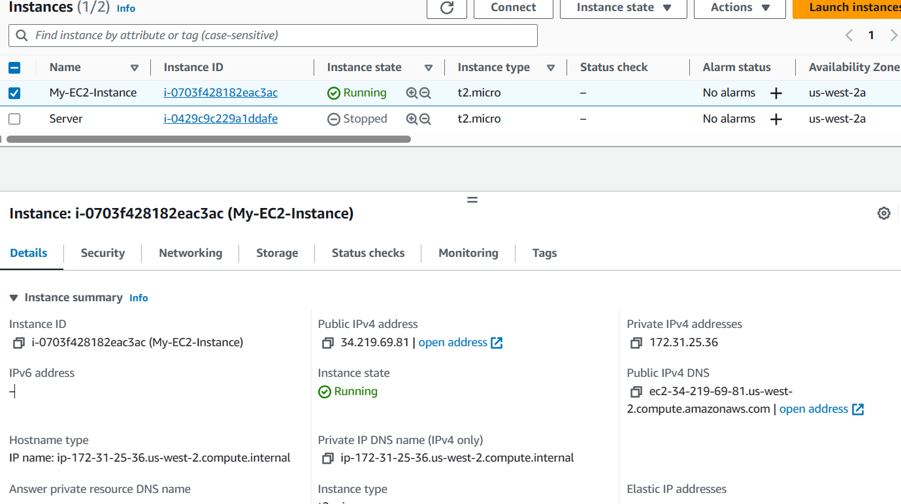

## Terraform Cont...

### Create EC2 Instance from Terraform File.
- Before writing terrafrom file to create EC2 instace, try to capture the manual steps to create an EC2 Instance
- Manual Steps
    - Instance Name
    - No of Instances
    - AMI (Amazon Machine Image)
    - Instance Type
    - Key Pair
    - Security Groups
    - Volumes
    - Termination Protection

- Terraform file
```
resource "aws_instance" "my-ec2" {
    ami = "ami-03f65b8614a860c29"
    instance_type = "t2.micro"
    key_name = "jenkins-server"
    count = 1
    vpc_security_group_ids = ["sg-08ac779c1bf102ceb"]

    tags = {
      Name = "My-EC2-Instance"
    }
}

```

- Terraform Plan
```
PS D:\Devops\July 2023\Terraform\terraform-files> terraform plan

Terraform used the selected providers to generate the following execution plan. Resource actions
are indicated with the following symbols:
  + create

Terraform will perform the following actions:

  # aws_instance.my-ec2[0] will be created
  + resource "aws_instance" "my-ec2" {
      + ami                                  = "ami-03f65b8614a860c29"
      + arn                                  = (known after apply)
      + associate_public_ip_address          = (known after apply)
      + availability_zone                    = (known after apply)
      + cpu_core_count                       = (known after apply)
      + cpu_threads_per_core                 = (known after apply)
      + disable_api_stop                     = (known after apply)
      + disable_api_termination              = (known after apply)
      + ebs_optimized                        = (known after apply)
      + get_password_data                    = false
      + host_id                              = (known after apply)
      + host_resource_group_arn              = (known after apply)
      + iam_instance_profile                 = (known after apply)
      + id                                   = (known after apply)
      + instance_initiated_shutdown_behavior = (known after apply)
      + instance_lifecycle                   = (known after apply)
      + instance_state                       = (known after apply)
      + instance_type                        = "t2.micro"
      + ipv6_address_count                   = (known after apply)
      + ipv6_addresses                       = (known after apply)
      + key_name                             = "jenkins-server"
      + monitoring                           = (known after apply)
      + outpost_arn                          = (known after apply)
      + password_data                        = (known after apply)
      + placement_group                      = (known after apply)
      + placement_partition_number           = (known after apply)
      + primary_network_interface_id         = (known after apply)
      + private_dns                          = (known after apply)
      + private_ip                           = (known after apply)
      + public_dns                           = (known after apply)
      + public_ip                            = (known after apply)
      + secondary_private_ips                = (known after apply)
      + security_groups                      = (known after apply)
      + source_dest_check                    = true
      + spot_instance_request_id             = (known after apply)
      + subnet_id                            = (known after apply)
      + tags                                 = {
          + "Name" = "My-EC2-Instance"
        }
      + tags_all                             = {
          + "Name" = "My-EC2-Instance"
        }
      + tenancy                              = (known after apply)
      + user_data                            = (known after apply)
      + user_data_base64                     = (known after apply)
      + user_data_replace_on_change          = false
      + vpc_security_group_ids               = [
          + "sg-08ac779c1bf102ceb",
        ]

      + capacity_reservation_specification {
          + capacity_reservation_preference = (known after apply)

          + capacity_reservation_target {
              + capacity_reservation_id                 = (known after apply)
              + capacity_reservation_resource_group_arn = (known after apply)
            }
        }

      + cpu_options {
          + amd_sev_snp      = (known after apply)
          + core_count       = (known after apply)
          + threads_per_core = (known after apply)
        }

      + ebs_block_device {
          + delete_on_termination = (known after apply)
          + device_name           = (known after apply)
          + encrypted             = (known after apply)
          + iops                  = (known after apply)
          + kms_key_id            = (known after apply)
          + snapshot_id           = (known after apply)
          + tags                  = (known after apply)
          + throughput            = (known after apply)
          + volume_id             = (known after apply)
          + volume_size           = (known after apply)
          + volume_type           = (known after apply)
        }

      + enclave_options {
          + enabled = (known after apply)
        }

      + ephemeral_block_device {
          + device_name  = (known after apply)
          + no_device    = (known after apply)
          + virtual_name = (known after apply)
        }

      + instance_market_options {
          + market_type = (known after apply)

          + spot_options {
              + instance_interruption_behavior = (known after apply)
              + max_price                      = (known after apply)
              + spot_instance_type             = (known after apply)
              + valid_until                    = (known after apply)
            }
        }

      + maintenance_options {
          + auto_recovery = (known after apply)
        }

      + metadata_options {
          + http_endpoint               = (known after apply)
          + http_protocol_ipv6          = (known after apply)
          + http_put_response_hop_limit = (known after apply)
          + http_tokens                 = (known after apply)
          + instance_metadata_tags      = (known after apply)
        }

      + network_interface {
          + delete_on_termination = (known after apply)
          + device_index          = (known after apply)
          + network_card_index    = (known after apply)
          + network_interface_id  = (known after apply)
        }

      + private_dns_name_options {
          + enable_resource_name_dns_a_record    = (known after apply)
          + enable_resource_name_dns_aaaa_record = (known after apply)
          + hostname_type                        = (known after apply)
        }

      + root_block_device {
          + delete_on_termination = (known after apply)
          + device_name           = (known after apply)
          + encrypted             = (known after apply)
          + iops                  = (known after apply)
          + kms_key_id            = (known after apply)
          + tags                  = (known after apply)
          + throughput            = (known after apply)
          + volume_id             = (known after apply)
          + volume_size           = (known after apply)
          + volume_type           = (known after apply)
        }
    }
```

- Terraform Apply
```
Do you want to perform these actions?
  Terraform will perform the actions described above.
  Only 'yes' will be accepted to approve.

  Enter a value: yes

aws_instance.my-ec2[0]: Creating...
aws_instance.my-ec2[0]: Still creating... [10s elapsed]
aws_instance.my-ec2[0]: Still creating... [20s elapsed]
aws_instance.my-ec2[0]: Still creating... [30s elapsed]
aws_instance.my-ec2[0]: Creation complete after 36s [id=i-0703f428182eac3ac]
```
