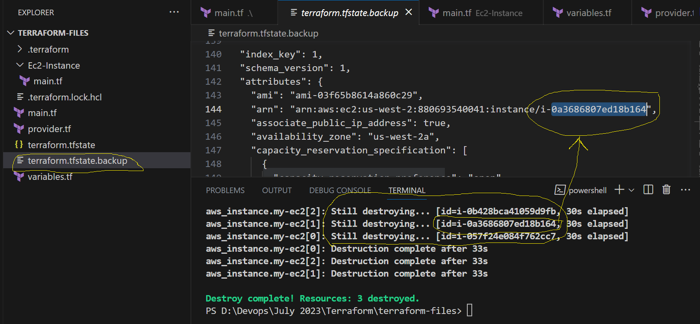
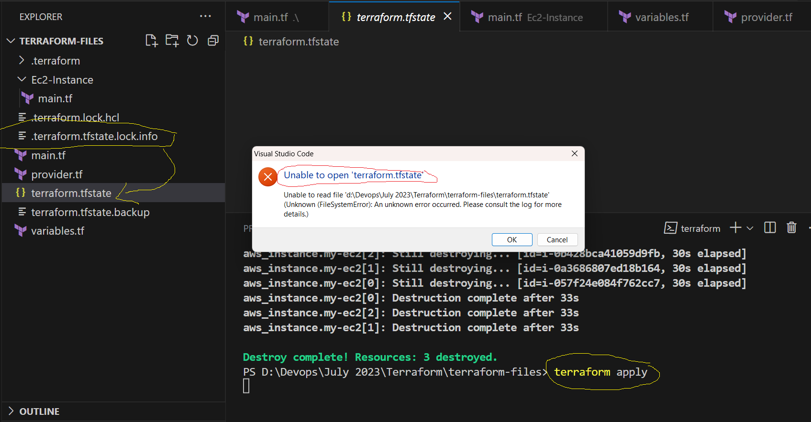
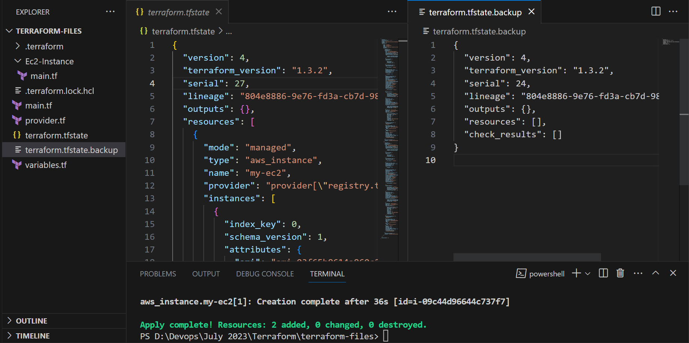

## Terraform Cont...

### How to create Multiple instances from single terraform file
- To do that, we have an function call **count**.
- We can use this count function and then call this at the time of execution
- Count take input as Array of List, which will start from **Index with 0**
- Below is the format how we can specify count in our terraform file
```'
count = 3 

count.index

count.0
count.1
count.2
```
- Let us modify our terraform file with count and index
- Latest Terraform file will look like this
```
resource "aws_instance" "my-ec2" {
    ami = "ami-03f65b8614a860c29"
    instance_type = "t2.micro"
    key_name = "jenkins-server"
    count = 3
    vpc_security_group_ids = ["sg-08ac779c1bf102ceb"]

    tags = {
      Name = "My-EC2-Instance-${count.index}"
    }
}
```
- When you do terraform plan, it will try to create no of instances from count value
- For ex below output shows you as per above terraform file
```
aws_instance.my-ec2[0] will be created
      + tags                                 = {
          + "Name" = "My-EC2-Instance-0"
        }

aws_instance.my-ec2[1] will be created
      + tags                                 = {
          + "Name" = "My-EC2-Instance-1"
        }

aws_instance.my-ec2[2] will be created
      + tags                                 = {
          + "Name" = "My-EC2-Instance-2"
        }
```

- Terraform Apply will look like this
```
  Enter a value: yes

aws_instance.my-ec2[2]: Creating...
aws_instance.my-ec2[1]: Creating...
aws_instance.my-ec2[0]: Creating...
aws_instance.my-ec2[2]: Still creating... [10s elapsed]
aws_instance.my-ec2[1]: Still creating... [10s elapsed]
aws_instance.my-ec2[0]: Still creating... [10s elapsed]
aws_instance.my-ec2[1]: Still creating... [20s elapsed]
aws_instance.my-ec2[2]: Still creating... [20s elapsed]
aws_instance.my-ec2[0]: Still creating... [20s elapsed]
aws_instance.my-ec2[0]: Creation complete after 25s [id=i-057f24e084f762cc7]
aws_instance.my-ec2[1]: Still creating... [30s elapsed]
aws_instance.my-ec2[2]: Still creating... [30s elapsed]
aws_instance.my-ec2[1]: Creation complete after 36s [id=i-0a3686807ed18b164]
aws_instance.my-ec2[2]: Creation complete after 36s [id=i-0b428bca41059d9fb]
```
- Terraform will try to create terraform.state.backup to keep your resources when you are creating new changes
- Every time new terraform.state file will be create with each change after taking of backup


- When you try to do terraform.apply you can't open or use your terraform.state file as it is locked


- After terraform.apply completes your terraform.state.backup will become empty


### How to store output values from terraform file
- When ever you create any resources or deploy any application you will get some result.
- In few situations you are supposed to take those result values and provide those as inputs to the other resources
- In this process you are supposed to store your results form the terraform. We use **output.tf** to store output values.
- Once the resources are created it will display the output as well.
- Terraform.plan will not display all the details until apply is executed.
- Example as below output for terraform plan from **Privat-ip** & **Public-ip**
```
resource "aws_instance" "my-ec2" {
    + private_ip                           = (known after apply)
    + public_dns                           = (known after apply)
    + public_ip                            = (known after apply)
    
}

```
- Syntax of taking the values from output as follows
```
output "name-of-output" {
    value = <resource>.<resource_name>.<attribute_name>
}

ex: 
output "public-ip" {
    value = aws_instance.my-ec2.public_ip 
}
```

- Create a file called **output.tf** and add the below values
```
output "public-ip" {
    value = aws_instance.my-ec2.public_ip  
}

output "private-ip" {
    value = aws_instance.my-ec2.private_ip
}
```
- After terraform.apply the output will be like this
```
C:\> terraform apply

Terraform used the selected providers to generate the following execution plan. Resource actions are
indicated with the following symbols:
  + create
Terraform will perform the following actions:

  # aws_instance.my-ec2 will be created
  + resource "aws_instance" "my-ec2" {
      + ami                                  = "ami-03f65b8614a860c29"
    + private_dns                          = (known after apply)
      + private_ip                           = (known after apply)
      + public_dns                           = (known after apply)
      + public_ip                            = (known after apply)
  }
  Enter a value: yes

Plan: 1 to add, 0 to change, 0 to destroy.

Changes to Outputs:
  + private-ip = (known after apply)
  + public-ip  = (known after apply)

Do you want to perform these actions?
  Terraform will perform the actions described above.
  Only 'yes' will be accepted to approve.

aws_instance.my-ec2: Creating...
aws_instance.my-ec2: Still creating... [10s elapsed]
aws_instance.my-ec2: Still creating... [20s elapsed]
aws_instance.my-ec2: Still creating... [30s elapsed]
aws_instance.my-ec2: Creation complete after 36s [id=i-0050429969553ae65]

Apply complete! Resources: 1 added, 0 changed, 0 destroyed.

Outputs:

private-ip = "172.31.22.214"
public-ip = "52.41.55.154"
```

