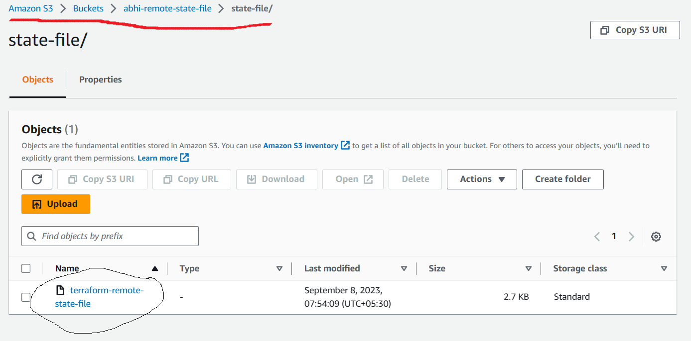
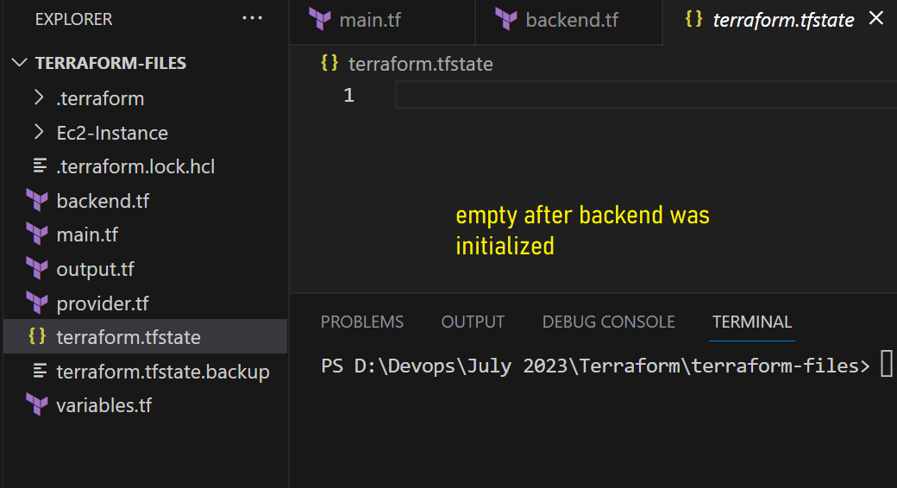

## Terraform Cont...

### Remote State File

- It is recommended to maintain your state file in Remote Place is nothing but in a Central Place where every user can access it from their own repsitories.
- As multiple developers are working on same repo and they are working together in same AWS Account and on same resources, we have to maintain a lock file so that the resources will not be mis-matched or mis-configured
- If you are maintaing state file in your local system individually, there can a chance that manual changes may happen which will lead to a problem in organization
- We can't figure out who is the culprit for the changes of your resources if state file is not maintained in central place
- We can manage multiple versions of your state file which can be useful for us to change as required
- To maintain State file in remote place you have to configure your backend information in your terraform file
- Basically the default Backend information will be stored in **S3 Bucket**

### How to configure our S3 Remote State information
- To do that, we have a block in terraform to specify your remote information
- Before specifying this make sure that you have a S3 Bucket already created in your AWS Account
- Syntax of Backend configuration is as follows
```
terraform {
    backend "<backend-type>"{
        name   = <name>
        key    = "<path-to-the-backend>"
        region  = "<region>"
        
    } 
}
```
- Below is the code to create S3 Bucket
```
resource "aws_s3_bucket" "remote-state" {
  bucket = var.s3-bucket
}

variable "s3-bucket" {
  type        = string
  description = "S3 Bucket"
  default     = "abhi-remote-state-file"
}
```
- After creating your S3 bucket, the 1st step to take action to store state informatino in remote place is **terraform init**
- This will initialize our state file with remote inforamtion.
- With out init if you try to do plan or apply it will give your the following error
```
C:\> terraform plan
╷
│ Error: Backend initialization required, please run "terraform init"
│ 
│ Reason: Initial configuration of the requested backend "s3"
│ 
│ The "backend" is the interface that Terraform uses to store state,
│ perform operations, etc. If this message is showing up, it means that the
│ Terraform configuration you're using is using a custom configuration for
│ the Terraform backend.
│ 
│ Changes to backend configurations require reinitialization. This allows
│ Terraform to set up the new configuration, copy existing state, etc. Please run
│ "terraform init" with either the "-reconfigure" or "-migrate-state" flags to
│ use the current configuration.
│
│ If the change reason above is incorrect, please verify your configuration
│ hasn't changed and try again. At this point, no changes to your existing
│ configuration or state have been made.
```
- When you do **terraform init** it will try to initialize the backend and will move the local state information into remote state
```
C:\> terraform init

Initializing the backend...
Do you want to copy existing state to the new backend?
  Pre-existing state was found while migrating the previous "local" backend to the
  newly configured "s3" backend. No existing state was found in the newly
  configured "s3" backend. Do you want to copy this state to the new "s3"
  backend? Enter "yes" to copy and "no" to start with an empty state.

  Enter a value: yes


Successfully configured the backend "s3"! Terraform will automatically
use this backend unless the backend configuration changes.

Initializing provider plugins...
- Reusing previous version of hashicorp/aws from the dependency lock file
- Using previously-installed hashicorp/aws v5.14.0

Terraform has been successfully initialized!

You may now begin working with Terraform. Try running "terraform plan" to see
any changes that are required for your infrastructure. All Terraform commands
should now work.

If you ever set or change modules or backend configuration for Terraform,
rerun this command to reinitialize your working directory. If you forget, other
commands will detect it and remind you to do so if necessary.
```


- Once you initialize your backed, our local state file will become empty


- After backend initiazliation was sucessfull, it will refresh the remote state
```
PS D:\Devops\July 2023\Terraform\terraform-files> terraform apply
aws_s3_bucket.remote-state: Refreshing state... [id=abhi-remote-state-file]

Terraform used the selected providers to generate the following execution plan. Resource actions are
indicated with the following symbols:
  + create
```
