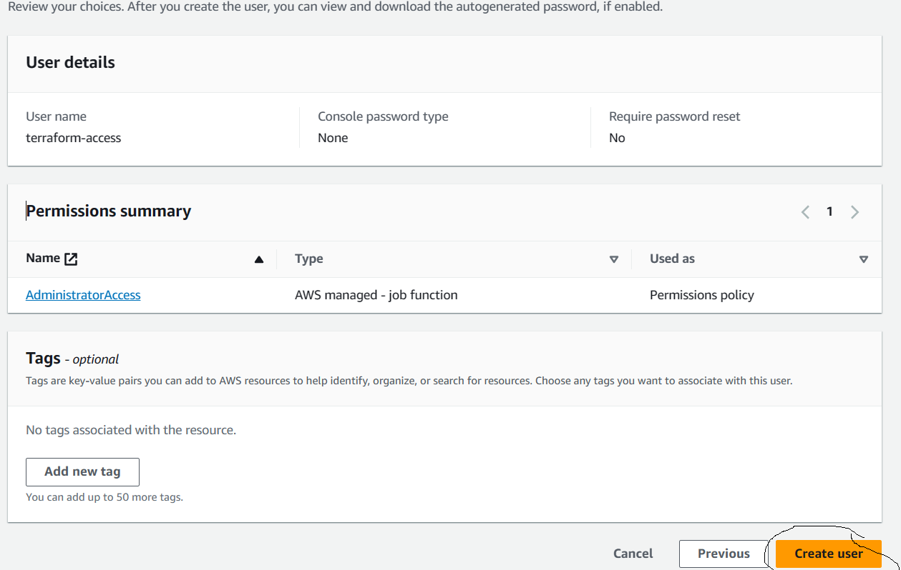

## Terraform Cont...

### Basic Terminology in Terraform
- Provider - Platform where we can create or resources
- Resources - Services which we use in creating our infrastructure in providers
- Arguments - Inputs that we pass to our code
- Attributes - Outps that we get after creating our resources
- Provisioners - These are used to execute scripts on your local machine or remote machine when resources are getting created. There are 2 type of provisioners.
    1. Generic Provisioners
    2. Vendor Provisioners
- StateFile - Statefile will store the status of all the resources created.

### Lifycycle of Terraform
- In Lifycle of terraform we have 5 stages
    1. **terraform init** - Initialization will be performed only after creation of your terraform file. Terraform init is the first step you have to perform. Initially it will an empty and after initialization it will try to download the **providers & resources** according to your terraform file.
    2. **terraform validate** - It is a kind of **syntax checker** where it will try to validate your terraform file.
    3. **terraform plan** - It is nothing but a blue print which will display the our actions after executing terraform file. What are resouces or action or modification which will be executed will be shown.
    4. **terraform apply** - When you run this command, terraform file will be executed and the resources will be executed.
    5. **terraform destroy** - It is used to remove your resources which were created from terraform apply stage.

- Terraform file will have extension of **.tf**
- Terraform was introduced by HashiCorp Organization

### How to Create / generate Access Key & Secret Access Key in AWS

