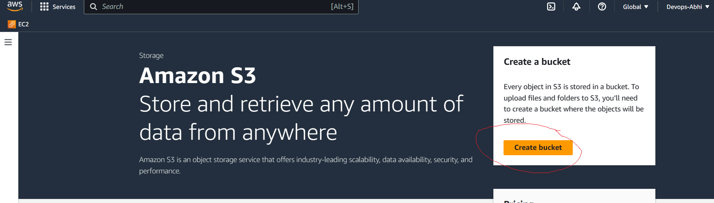
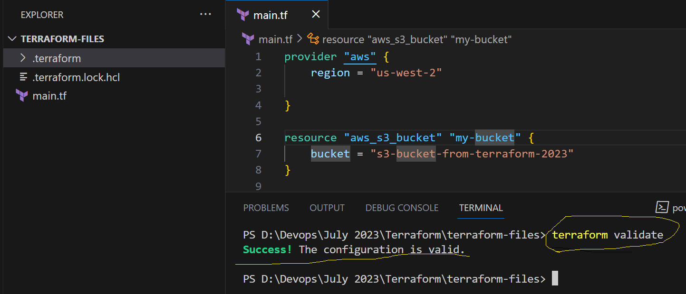

## Terraform Cont...

### How to Write my First Terraform File.
- Before Writing your terraform file you have to be familiar with all the manual steps to create any resources in any service providers.
- Make a note of all the Manual steps then we will proceed further to create your **Terraform File**.
- As we are not performing our actions from AWS console you need to have something which will support to manage your activities from out side of AWS.
- Simply we can say that it is an API connectivity.
- For this you need to have 2 keys
    1. Access Key ID
    2. Secret Access Key
- In yesterdays notes it is already exist on how to create keys.

### Let us capture the manual step in creating S3 Bucket resource in AWS
- Below are the manual steps to create an S3 Bucket




### Let us write our 1st Terraform File.
- Install the below Extension in your VS Code


- Below is the structure of Terraform File
- File name will have the extension of **.tf**
- it should be like **main.tf**
- Main block you have to specify in your terraform file is that as below
    1. Provider Details
    2. Resources Details

- Provider Block systax is as follows
```
provider "<provider_name>" {
    <argument1> : <value1>
    <argument1> : <value1>
    <argument1> : <value1>
}

provider "aws" {
  region     = "us-west-2"
  access_key = "my-access-key"
  secret_key = "my-secret-key"
}
```

- Resources Block systax is as follows
```
resource "<resource_name>" "<your_resource_name>" {
    <argument1> : <value1>
    <argument1> : <value1>
    <argument1> : <value1>
}

resource "aws_s3_bucket" "example" {
  bucket = "my-tf-test-bucket"

  tags = {
    Name        = "My bucket"
    Environment = "Dev"
  }
}
```

- Once your write your terraform file, the 1st step to perform is **terraform init**
- When you do terraform init it will try to download the provider and plugins into your local system with **.terraform** folder

- Next step is **terraform validate**



